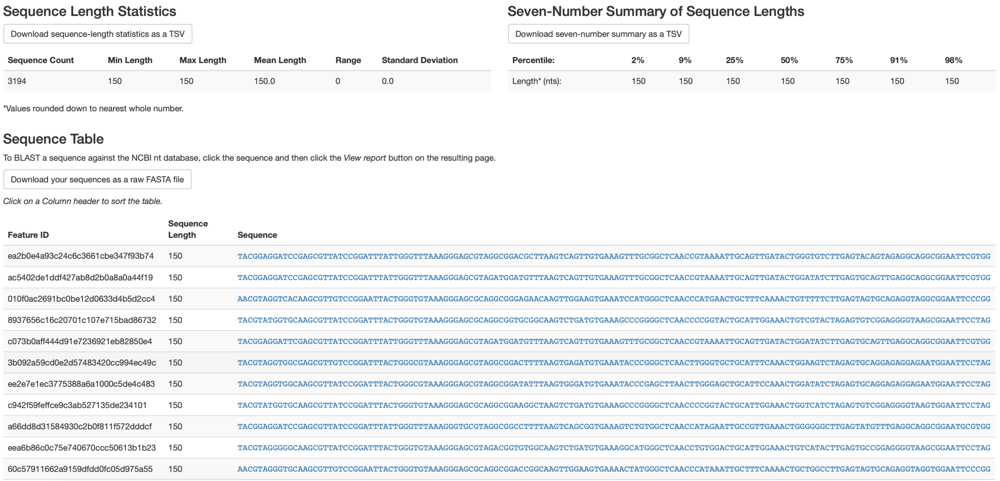
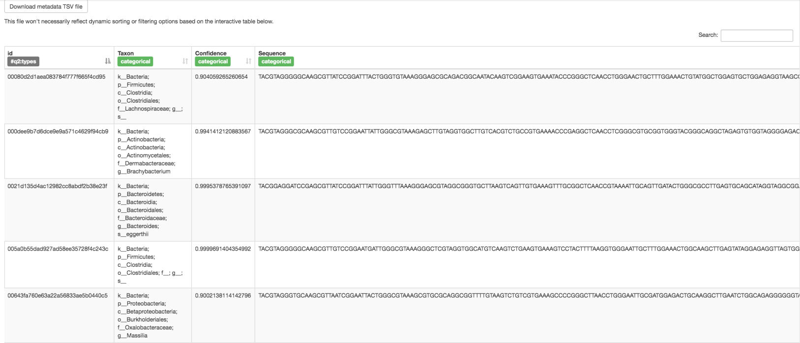
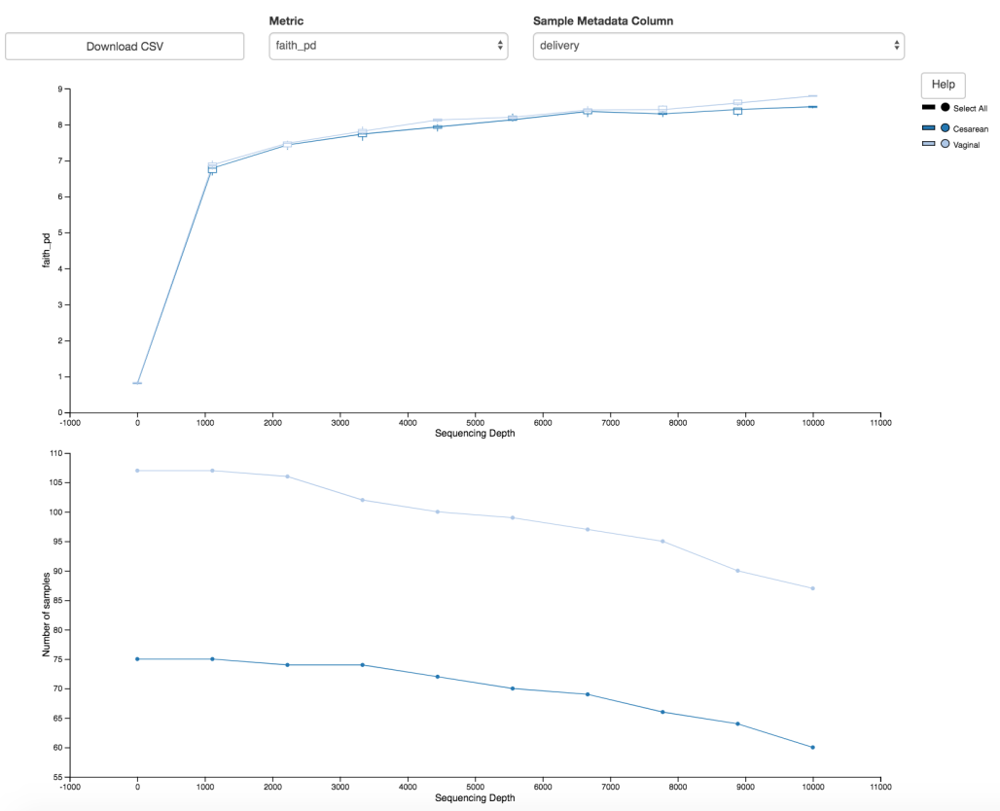
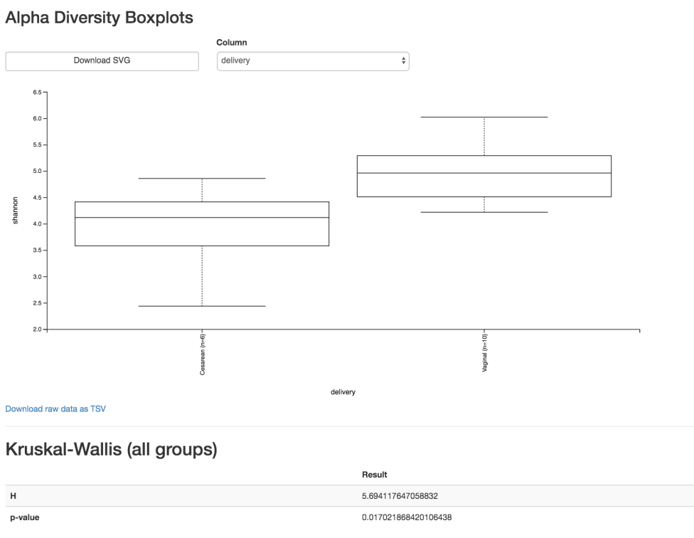
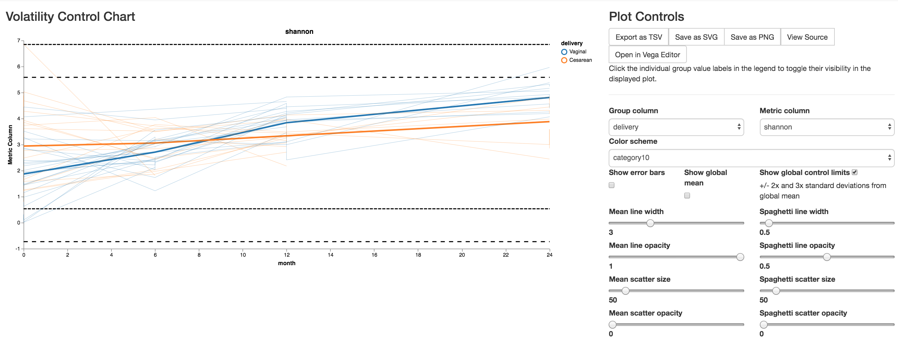

Comprehensive end-to-end microbiome analysis using QIIME 2
==========================================================

**Title:** QIIME 2 enables comprehensive end-to-end analysis of diverse
microbiome data and comparative studies with publicly available data

**Running Title:** Comprehensive end-to-end microbiome analysis using QIIME 2

**Authors:** Mehrbod Estaki :sup:`1,#`, Lingjing Jiang :sup:`2,#`, Nicholas A.
Bokulich :sup:`3,4`, Daniel McDonald :sup:`1`, Antonio González :sup:`1`,
Tomasz Kosciolek :sup:`1,5`, Cameron Martino :sup:`6,7`, Qiyun Zhu :sup:`1`,
Amanda Birmingham :sup:`8`, Yoshiki Vázquez-Baeza :sup:`7,9`, Matthew R. Dillon
:sup:`3`, Evan Bolyen :sup:`3`, J. Gregory Caporaso :sup:`3,4`, Rob Knight
:sup:`1,7,10,11*`

:sup:`1` Department of Pediatrics, University of California San Diego, La
Jolla, CA, USA, :sup:`2` Division of Biostatistics, University of California
San Diego, La Jolla, CA, USA, :sup:`3` Center for Applied Microbiome Science,
Pathogen and Microbiome Institute, Northern Arizona University, Flagstaff, AZ,
USA, :sup:`4` Department of Biological Sciences, Northern Arizona University,
Flagstaff, AZ, USA, :sup:`5` Malopolska Centre of Biotechnology, Jagiellonian
University, Kraków, Poland, :sup:`6` Bioinformatics and Systems Biology
Program, University of California San Diego, La Jolla, CA, USA, :sup:`7` Center
for Microbiome Innovation, University of California San Diego, La Jolla, CA,
USA, :sup:`8` Center for Computational Biology and Bioinformatics, UC San
Diego, La Jolla, CA, USA, :sup:`9` Jacobs School of Engineering, University of
California San Diego, La Jolla, CA, USA, :sup:`10` Department of Computer
Science and Engineering, University of California San Diego, La Jolla, CA, USA,
:sup:`11` Department of Bioengineering, University of California San Diego, La
Jolla, CA, USA

:sup:`*` To whom correspondence should be addressed.

Rob Knight
9500 Gilman Dr. MC 0763
La Jolla, CA 92093
Phone: 858-246-1184
Email: robknight@ucsd.edu

:sup:`#` The first two authors should be regarded as Joint First Authors.

Abstract
========

QIIME 2 is a completely reengineered microbiome bioinformatics platform based
on the popular QIIME platform, which it has replaced. QIIME 2 facilitates
comprehensive and fully reproducible microbiome data science, improving
accessibility to diverse users by adding multiple user interfaces. QIIME 2 can
be combined with Qiita, an open-source web-based platform, to re-use available
data for meta-analysis. The following protocol describes how to install QIIME 2
on a single computer and analyze microbiome sequence data, from processing of
raw DNA sequence reads through generating publishable interactive figures.
These interactive figures allow readers of a study to interact with data with
the same ease as its authors, advancing microbiome science transparency and
reproducibility. We also show how plug-ins developed by the community to add
analysis capabilities can be installed and used with QIIME 2, enhancing various
aspects of microbiome analyses such as improving taxonomic classification
accuracy. Finally, we illustrate how users can perform meta-analyses combining
different datasets using readily available public data through Qiita. In this
tutorial, we analyze a subset of the Early Childhood Antibiotics and the
Microbiome (ECAM) study, which tracked the microbiome composition and
development of 43 infants in the United States from birth to two years of age,
identifying microbiome associations with antibiotic exposure, delivery mode,
and diet. For more information about QIIME 2, see https://qiime2.org. To
troubleshoot or ask questions about QIIME 2 and microbiome analysis, join the
active community at https://forum.qiime2.org.

*Keywords:* Microbiome, QIIME 2, bioinformatics, Qiita, metagenomics

Introduction
============

This tutorial illustrates the use of QIIME 2 (Bolyen et al., 2019) in
processing, analyzing, and visualizing microbiome data. Here we use, as an
example, a high-throughput 16S rRNA gene sequencing study, starting with raw
sequences and producing publication-ready analysis and figures. QIIME 2 can
also process other types of microbiome data, including amplicons of other
markers such as 18S rRNA, ITS, and COI, shotgun metagenomics, and untargeted
metabolomics. We will also show how to combine results from an individual study
with data from other studies using the Qiita public database framework
(Gonzalez et al., 2018), which can be used to confirm relationships between
microbiome and phenotype variables in a new cohort, or to generate hypotheses
for future testing.

A typical QIIME 2 analysis can vary in many ways, depending on your
experimental and data analysis goals and on how you collected the data. In this
tutorial, we use the QIIME 2 command-line interface, and focus on processing
and analyzing a subset of samples from the Early Childhood Antibiotics and the
Microbiome (ECAM) study (Bokulich, Chung, et al., 2016). We will start with raw
sequence files and use a single analysis pipeline for clarity, but note where
alternative methods are possible and why you might want to use them.

Before Starting
---------------

We recommend that you read about the core concepts of QIIME 2
(https://docs.qiime2.org/2019.10/concepts/) before starting this tutorial to
familiarize yourself with the platform's main features and concepts, including
enhanced visualization methods through QIIME 2 View, decentralized provenance
tracking (which ensures reproducible bioinformatics), multiple interfaces
(including the Python 3 API and QIIME 2 Studio graphical interface), the
plugin architecture (which enables anyone to expand QIIME 2's functionality),
and semantic types (which enables QIIME 2 to help users avoid misusing their
data). In general, we suggest referring to the QIIME 2 website
(https://qiime2.org), which will always be the most up-to-date source for
information and tutorials on QIIME 2, including newer versions of this
tutorial. Questions, suggestions, and general discussion should always be
directed to the QIIME 2 Forum (https://forum.qiime2.org). A brief 'Glossary of
terms' for common QIIME 2 terminology is provided as Appendix 1.

USING QIIME 2 WITH MICROBIOME DATA
==================================

Necessary resources
-------------------

*Hardware:* QIIME 2 can be installed on almost any computer system (native
installation is available on Mac OS and Linux; or Windows via a virtual
machine). The amount of free disk space and memory you will need vary
dramatically depending on the number of samples and sequences you will analyze,
and the algorithms you will use to do so. At present QIIME 2 requires a minimum
of 6-7 GB for installation, and we recommend a minimum of 4 GB of memory as a
starting point for small, and 8 GB of memory for most real-world datasets.
Other types of analyses, such as those using shotgun
metagenomics plugins, may require significantly more memory and disk space.

*Software:* An up-to-date web browser, such as the latest version of Firefox or
Chrome is needed for the visualizations using QIIME 2 View.

Installing QIIME 2
------------------

The latest version of QIIME 2, as well as detailed instructions on how to
install on various operating systems, can be found at https://docs.qiime2.org.
QIIME 2 utilizes a variety of external independent packages, and while we
strive to maintain backward compatibility, occasionally changes or updates to
these external packages may create compatibility issues with older versions of
QIIME 2. To avoid these problems we recommend always using the most recent
version of QIIME 2 available online. The online tutorial will always provide
installation instructions for the most up-to-date, tested, and stable version
of QIIME 2.

.. topic:: Troubleshooting:

    If you encounter any issues with installation, or at any other stages of
    this tutorial, please get in touch on the QIIME 2 Forum at
    https://forum.qiime2.org.  The QIIME 2 Forum is the hub of the QIIME 2 user
    and developer communities. Technical support for users and developers is
    provided there, free of charge. We try to reply to technical support
    questions on the forum within 1-2 business days (though sometimes we need
    more time). Getting involved on the QIIME 2 Forum, for example by reading
    existing posts, answering questions, or sharing resources that you've
    created such as educational content, is a great way to get involved with
    QIIME 2. We strive to create an inclusive and welcoming community where we
    can collaborate to improve microbiome science. We hope you'll join us!

(Re)Activating QIIME 2
----------------------

If at any point during the analysis the QIIME 2 conda environment is closed
or deactivated, QIIME 2 2019.10 can be reactivated by running the following
command:

.. command-block::
   :no-exec:

   conda activate qiime2-2019.10

To determine the currently active conda environment, run the following
command and look for the line that starts with “active environment”:

.. command-block::
   :no-exec:

   conda info

Using this tutorial
-------------------

The following protocol was completed using QIIME 2 2019.10 and demonstrates
usage with the command line interface (CLI). For users comfortable with
Python 3 programming, an application programmer interface (API) version of
this protocol is also available at
https://github.com/qiime2/paper2/blob/master/notebooks/qiime2-protocol-API.ipynb.
No additional software is needed for using the API. Jupyter notebooks for
both of these protocols are also available at
https://github.com/qiime2/paper2/tree/master/notebooks. Finally, an enhanced
interactive online version of the CLI protocol is also available at
https://curr-protoc-bioinformatics.qiime2.org with all intermediate files
precomputed. While we strongly encourage users to install QIIME 2 and follow
along this tutorial, this enhanced tutorial provides an alternative for when
time and computational resources are limited. Following along the online
version of this protocol enables users to skip any step and instead download
the pre-processed output required for a subsequent step. Additionally, the
online version also provides simple 'copy to clipboard' buttons for each code
block which, unlike copying from a PDF file, retains the original formatting
of the code, making it easy to paste into other environments. The enhanced
online protocol will also be updated regularly with every new release of
QIIME 2, unlike the PDF version.

Acquire the data from the ECAM study
------------------------------------

In this tutorial, we'll be using QIIME 2 to perform cross-sectional as well as
longitudinal analyses of human infant fecal microbiome samples. The samples we
will be analyzing are a subset of the ECAM study, which consists of monthly
fecal samples collected from children at birth up to 24 months of life, as well
as corresponding fecal samples collected from the mothers throughout the same
period. The original sequence files from this study are of the V4 region of the
16S rRNA gene that were sequenced across 5 separate runs (2x150 bp) on an
Illumina MiSeq machine. To simplify and reduce the computational time required
for this tutorial we have selected the forward reads of a subset of these
samples for processing. To follow along with this protocol, create a new
directory then download the raw sequences (~ 700 MB) and the corresponding
sample metadata file into it.

.. command-block::

    mkdir qiime2-ecam-tutorial
    cd qiime2-ecam-tutorial

.. download::
   :url: https://qiita.ucsd.edu/public_artifact_download/?artifact_id=81253
   :saveas: 81253.zip

.. command-block::
   :expect-exit-codes: 2 0

   unzip 81253.zip
   mv mapping_files/81253_mapping_file.txt metadata.tsv

The bad CRC warnings here are fine to ignore. These are related to downloading
large files from Qiita and do not interfere with downstream work. You can also
delete the original zip file ``81253.zip`` now to save space.

Explore sample metadata files
-----------------------------

In the previous step, in addition to downloading sequence data, we downloaded
a researcher-generated sample metadata. In the context of a microbiome
study, sample metadata are any data that describe characteristics of the
samples that are being studied, the site they were collected from, and/or how
they were collected and processed. In this example, the ECAM study metadata include
characteristics like age at the time of collection, birth mode and diet of the
child, the type of DNA sequencing, and other information. This is all
information that is generally compiled at the time of sample collection, so
is something the researcher should be working on prior to a QIIME 2 analysis.
Suggested standards
for the type of study metadata to collect, and how to represent the values, are
discussed in detail in MIMARKS and MIxS (Yilmaz et al., 2011). In this
tutorial, we also include a Support Protocol on metadata preparation to help
users generate quality metadata. In QIIME 2, metadata is most commonly stored
as a TSV (i.e. tab-separated values) file. These files typically have a
``.tsv`` or ``.txt`` file extension. TSV files are text files used to store
data tables, and the format can be read, edited and written by many types of
software, including spreadsheets and databases. Thus, it's usually
straightforward to manipulate QIIME 2 sample metadata using the software of
your choosing. You can use a spreadsheet program of your choice such as Google
Sheets to edit and export your metadata files, but you must be extremely
cautious about automatic, and often silent, reformatting of values using these
applications. For example, the use of programs like Excel can lead to unwanted
reformatting of values, insertion of invisible spaces, or sorting of a table in
ways that scramble the connection between sample identifiers and the data.
These problems are very common and can lead to incorrect results, including
missing statistically significant patterns. See the "Metadata preparation"
section in the Support Protocols at the end of this document for details
regarding best practices for creating and maintaining metadata files.

Detailed formatting requirements for QIIME 2 metadata files can be found at
https://docs.qiime2.org/2019.10/tutorials/metadata/. Metadata files stored in
Google Sheets can be validated using Keemei (Rideout et al., 2016), an
open-source Google Sheets plugin available at https://keemei.qiime2.org. Once
Keemei is installed, in Google Sheets select Add-ons > Keemei > Validate QIIME
2 metadata file to determine whether the metadata file meets the required
formatting of QIIME 2.

Open the ``metadata.tsv`` file with your software of choosing and explore the
content. Take note of the column names as we will be referring to these
throughout the protocol. Cual-ID may be useful for creating sample identifiers,
and the Cual-ID paper (Chase, Bolyen, Rideout, & Caporaso, 2016) provides some
recommendations on best practices for creating sample identifiers for data
management.

Importing DNA sequence data into QIIME 2 and creating a visual summary
----------------------------------------------------------------------

The next step is to import our DNA sequence data (in this case, from the 16S
rRNA gene) into QIIME 2. All data used and generated by QIIME 2, with the
exception of metadata, exist as QIIME 2 artifacts, and use the ``.qza`` file
extension. Artifacts are zip files containing data (in the usual formats, such
as FASTQ) and QIIME 2-specific metadata describing the various characteristics
of the data such as its semantic type, data file format, relevant citations for
analysis steps that were performed to this point, and the QIIME 2 steps that
were taken to generate it (i.e., the data provenance).

QIIME 2 allows you to import and export data at many different steps, so that
you can export it to other software or try out alternative methods for
particular steps. When importing data into QIIME 2, you need to provide detail
on what the data are, including the file format and the semantic type.
Currently, the most common type of raw data from high-throughput amplicon
sequencing is in FASTQ format. These files may contain single-end or paired-end
DNA sequence reads, and will be in either multiplexed or demultiplexed format.
Multiplexed files typically come as two (or three in the case of paired-end
runs) files consisting of your sequences (forward and/or reverse, often but not
always referred to as R1 and R2 reads, respectively) and a separate barcode
file (often but not always referred to as the I1 reads). In demultiplexed
format, you will have one (or two in the case of paired-end data) sequence
files per sample as the sequences have already been assigned to their
designated sample IDs based on the barcode files. For the demultiplexed format,
the sample name will typically be a part of the file name. In this protocol our
sequences are in single-end demultiplexed FASTQ format produced by Illumina's
Casava software. As our data is split across multiple files, to import we will
need to provide QIIME 2 with the location of our files and assign them sample
IDs; this is done using the manifest file. A manifest file is a user-created
tab-separated values file with two columns: the first column sample-id holds
the name you assign to each of your samples, and the second column
absolute-filepath provides the absolute file path leading to your raw sequence
files. For example:

.. code-block:: none

    sample-id	absolute-filepath
    10249.M001.03R	$PWD/demux-se-reads/10249.M001.03R.fastq.gz
    10249.M001.03SS	$PWD/demux-se-reads/10249.M001.03SS.fastq.gz
    10249.M001.03V	$PWD/demux-se-reads/10249.M001.03V.fastq.gz

Alternatively, your sample metadata file can also double as a manifest file by
adding the absolute-filepath column to it; in this protocol we demonstrate the
creation and use of a separate manifest file. You can create a manifest file in
a variety of ways using your favorite text editor application. Here we use a
simple bash script to create ours.

1. Create the manifest file with the required column headers.

.. command-block::

    echo -e "sample-id\tabsolute-filepath" > manifest.tsv

2. Use a loop function to insert the sample names into the sample-id column and
   add the full paths to the sequence files in the absolute-filepath column.

.. command-block::

    for f in `ls per_sample_FASTQ/81253/*.gz`; do n=`basename $f`; echo -e "12802.${n%.fastq.gz}\t$PWD/$f"; done >> manifest.tsv

3. Use the manifest file to import the sequences into QIIME 2

.. command-block::

   qiime tools import \
       --input-path manifest.tsv \
       --type 'SampleData[SequencesWithQuality]' \
       --input-format SingleEndFastqManifestPhred33V2 \
       --output-path se-demux.qza

.. topic:: Alternative Pipeline:

    Your data may not be demultiplexed prior to importing to QIIME 2.
    Instructions on how to import multiplexed FASTQ files, as well as a variety
    of other data types, can be found online at
    https://docs.qiime2.org/2019.10/tutorials/importing/. With multiplexed
    data, you will also need to demultiplex your sequences prior to the next
    step.  Demultiplexing in QIIME 2 can be performed using either the q2-demux
    (https://docs.qiime2.org/2019.10/plugins/available/demux/) plugin which is
    optimized for data produced using the EMP protocol (Caporaso et al., 2012),
    or the q2-cutadapt
    (https://docs.qiime2.org/2019.10/plugins/available/cutadapt/) plugin (which
    additionally supports demultiplexing of dual-index barcodes using cutadapt
    (Martin, 2011))

The demultiplexed artifact allows us to create an interactive summary of our
sequences. This summary provides information useful for assessing the quality
of the DNA sequencing run, including the number of sequences that were obtained
per sample, and the distribution of sequence quality scores at each position.

4. Create a summary of the demultiplexed artifact:

.. command-block::

    qiime demux summarize \
        --i-data se-demux.qza \
        --o-visualization se-demux.qzv

You'll notice that the output of the summarize action above is a Visualization,
with the file extension ``.qzv``. Visualizations are a type of QIIME 2 Result. Like
Artifacts, the other type of QIIME 2 Result, they contain information such as
metadata, provenance, and relevant citations, but they are outputs that cannot
be used as input to other analyses in QIIME 2. Instead, they are intended for
human consumption. Visualizations often contain a statistical results table, an
interactive figure, one or more static images, or a combination of these.
Because they don't need to be used for downstream data analysis in QIIME 2,
there is a lot of flexibility in what they can contain. All QIIME 2 Results,
including Visualizations and Artifacts, can be viewed by running qiime tools
view or alternatively by loading them with QIIME 2 View
(https://view.qiime2.org/). QIIME 2 View does not require QIIME 2 to be
installed, making it useful for sharing data with collaborators who do not have
QIIME 2 installed. Try visualizing ``se-demux.qzv`` using each of these methods,
then use the method you prefer for the rest of this tutorial.

.. command-block::
   :no-exec:

    qiime tools view se-demux.qzv

5. Explore the Visualization results:

In the first 'Overview' tab we see a summary of our sequence counts followed by
a per-sample breakdown. If you click on the 'Interactive Quality plot' (Figure
1), you can interact with the sequence quality plot, which shows a boxplot of
the quality score distribution for each position in your input sequences.
Because it can take a while to compute these distributions from all of your
sequence data (often tens of millions of sequences), a subset of your reads are
selected randomly (sampled without replacement), and the quality scores of only
those sequences are used to generate the boxplots. By default, 10,000
sequences are subsampled, but you can control that number with ``--p-n`` on the
demux summarize command. Keep in mind that because of this random subsampling,
every time you run demux summarize on the same sequence data you will obtain
slightly different plots.

Click and drag on plot to zoom in. When you hover the mouse over a boxplot
for a given base position, the boxplot's data is shown in a table below
the interactive plot as a parametric
seven-number summary This is a standard summary statistics of a dataset
composed of 2nd, 9th, 25th, 50th, 75th, 91st, and 98th percentiles and can be
used as a simple check for assumptions of normality. These values describe the
distribution of quality scores at that position in your subsampled sequences.
You can click and drag on the plot to zoom in, or double click to zoom back out
to full size. These interactive plots can be used to determine if there is a
drop in quality at some point in your sequences, which can be useful in
choosing truncation and trimming parameters in the next section.

Sequence quality control and feature table construction
-------------------------------------------------------

Traditionally, quality control of sequences was performed by trimming and
filtering sequences based on their quality scores (Bokulich et al., 2013),
followed by clustering them into operational taxonomic units (OTUs) based on a
fixed dissimilarity threshold, typically 97% (Rideout et al., 2014). Today,
there are better methods for quality control that correct amplicon sequence
errors and produce high-resolution amplicon sequence variants that, unlike
OTUs, resolve differences of as little as one nucleotide. These "denoisers"
have many advantages over traditional clustering-based methods, as discussed in
(Callahan, McMurdie, & Holmes, 2017). QIIME 2 currently offers denoising via
DADA2 (q2-dada2) and Deblur (q2-deblur) plugins. The inferred ESVs produced by
DADA2 are referred to as amplicon sequence variants (ASVs), while those created
by Deblur are called sub-OTUs (sOTUs). In this protocol we will refer to
products of these denoisers, regardless of their method of origin, as features.
The major differences in the algorithms and motivation for these and other
denoising methods are reviewed in Nearing et al. (Nearing, Douglas, Comeau, &
Langille, 2018) and Caruso et al. (Caruso, Song, Asquith, & Karstens, 2019).
According to these independent evaluations, denoising methods were consistently
more successful than clustering methods in identifying true community
composition while only small differences were reported among the denoising
methods. We therefore view method selection here as a personal choice that
research teams should make. Some practical differences may drive selection of
these methods. For instance, DADA2 includes joining of paired-end reads in its
processing workflow and is therefore simpler to use when paired-end read
joining is desired, while Deblur users must join reads independently prior to
denoising using other plugins such as q2-vsearch's join-pairs method (Rognes,
Flouri, Nichols, Quince, & Mahژ, 2016).

In this tutorial, we'll denoise our sequences with q2-deblur which uses a
pre-calculated static sequence error profile to associate erroneous sequence
reads with the true biological sequence from which they are derived. Unlike
DADA2, which creates sequence error profiles on a per analysis basis, this
allows Deblur to be simultaneously applied across different datasets,
reflecting its design motivation for performing meta-analyses. Additionally,
using a pre-defined error profile generally results in shorter runtimes.

Deblur is applied in two steps.

1. Apply an initial quality filtering process based on quality scores. This
   method is an implementation of the quality filtering approach described by
   Bokulich et al. (Bokulich et al., 2013).

.. command-block::

    qiime quality-filter q-score \
        --i-demux se-demux.qza \
        --o-filtered-sequences demux-filtered.qza \
        --o-filter-stats demux-filter-stats.qza

2. Apply the Deblur workflow using the denoise-16S action. This method requires
   one parameter that is used in quality filtering, ``--p-trim-length`` which
   truncates the sequences at position n. The choice of this parameter is based
   on the subjective assessment of the quality plots produced from the previous
   step. In general, we recommend setting this value to a length where the
   median quality score begins to drop below 30, or 20 if the overall run
   quality is too low. One situation where you might deviate from that
   recommendation is when performing a meta-analysis across multiple sequencing
   runs. In this type of meta-analysis, it is critical that the read lengths be
   the same for all of the sequencing runs being compared to avoid introducing
   a study-specific bias. In the current example dataset, our quality plot
   shows high quality scores along the full length of our reads, therefore it
   is reasonable to truncate our reads at the 150 bp position.

.. command-block::

    qiime deblur denoise-16S \
        --i-demultiplexed-seqs demux-filtered.qza \
        --p-trim-length 150 \
        --p-sample-stats \
        --p-jobs-to-start 4 \
        --o-stats deblur-stats.qza \
        --o-representative-sequences rep-seqs-deblur.qza \
        --o-table table-deblur.qza

.. topic:: Tip!

    The denoising step is often one of the longest steps in microbiome analysis
    pipelines. Luckily, both DADA2 and Deblur are parallelizable, meaning you
    can significantly reduce computation time if your machine has access to
    multiple cores. To increase the number of cores you wish to designate to
    this task, use the ``--p-jobs-to-start`` parameter to change the default
    value of 1 to a value suitable to your machine. As a reminder, if you are
    following the online version of this protocol, you can skip this step and
    download the output artifacts and use those in the following steps.

Deblur generates three outputs. An artifact with the semantic type
``FeatureTable[Frequency]``, which is a table of the count of each observed
feature in each sample, and an artifact with the semantic type
``FeatureData[Sequence]``, which contains the sequence that defines each
feature in the table which will be used later for assigning taxonomy to
features and generating a phylogenetic tree, and summary statistics of the
Deblur run in a DeblurStats artifact. Each of these artifacts can be visualized
to provide important information.

3. Create a visualization summary of the DeblurStats artifact with the command:

.. command-block::

    qiime deblur visualize-stats \
        --i-deblur-stats deblur-stats.qza \
        --o-visualization deblur-stats.qzv

The statistics summary (Figure 2) provides us with information about what
happened to each of the samples during the deblur process. The reads-raw column
gives information on the number of reads presented to the deblur algorithm.
Because deblur works by deleting erroneous reads that it detects, the final
number of reads is smaller than the starting number. The three columns that
follow (*fraction-artifact-with-minsize*, *fraction-artifact* and
*fraction-missed-reference*) summarize the data from other columns in a
convenient way. They identify potential problems with the data at an early
stage. *Fraction-artifact-with-minsize* is the fraction of sequences detected as
artifactual, including those that fall below the minimum length threshold
(specified by the ``--p-trim-length parameter``). *Fraction-artifact* is the
fraction of raw sequences that were identified as artifactual.
*Fraction-missed-reference* is the fraction of post-deblur sequences that were
not recruited by the positive reference database. The subsequent columns
provide information about the number of sequences remaining after dereplication
(*unique-reads-derep*, *reads-derep*), following deblurring (*unique-reads-deblur*,
*reads-deblur*), number of hits that recruited to the negative reference database
following deblurring process (*unique-reads-hit-artifact*, *reads-hit-artifact*),
*chimeric sequences detected* (*unique-reads-chimeric* and *reads-chimeric*),
sequences that match/miss the positive reference database
(*unique-reads-hit-reference*, *reads-hit-reference*, *unique-reads-missed-reference*
and *reads-missed-reference*).  The number in the *reads-hit-reference* column is
the final number of per-sample sequences present in the ``table-deblur.qza``
QIIME 2 artifact.

.. note::

    The shorthand "artifact" in the per-sample Deblur statistics denotes
    artifactual sequences (i.e. those erroneously generated as byproducts of
    the PCR and DNA sequencing process), not a QIIME 2 artifact (i.e. a valid
    data product of QIIME 2).

4. Visualize the representative sequences by entering:

.. command-block::

    qiime feature-table tabulate-seqs \
        --i-data rep-seqs-deblur.qza \
        --o-visualization rep-seqs-deblur.qzv

This Visualization (Figure 3) will provide statistics and a seven-number
summary of sequence lengths, and more importantly, show a sequence table that
maps feature IDs to sequences, with links that allow you to easily BLAST each
sequence against the NCBI nt database. To BLAST a sequence against the NCBI nt
database, click the sequence and then click the View report button on the
resulting page. This will be useful later in the tutorial, when you want to
learn more about specific features that are important in the data set. Note
that automated taxonomic classification is performed at a later step, as
described below; the NCBI-BLAST links provided in this Visualization are useful
for assessing the taxonomic affiliation and alignment of individual features to
the reference database. Results of the 'top hits' from a simple BLAST search
such as this are known to be poor predictors of the true taxonomic affiliations
of these features, especially in cases where the closest reference sequence in
the database is not very similar to the sequence you are using as a query.

.. note::

    By default, QIIME 2 uses MD5 hashing of a feature's full sequence to assign
    a feature ID. These are the 32-bit strings of numbers and characters you
    see in the Feature ID column above. Hashing in q2-deblur can be disabled by
    adding the ``--p-no-hashed-feature-ids`` parameter.

5. Visualize the feature table. Note that in this step, we can provide our
   metadata file, which then adds information about sample groups into the
   resulting summary output. Adding the metadata is useful for checking that
   all groups (e.g. a given age or sex of subject) have enough samples and
   sequences to proceed with analysis. This check is important because
   variation in the number of sequences per sample, which is typically not
   fully under control, often leads to samples dropping out of the analysis
   because too few reads were obtained from them.

.. command-block::

    qiime feature-table summarize \
        --i-table table-deblur.qza \
        --m-sample-metadata-file metadata.tsv \
        --o-visualization table-deblur.qzv

The first 'Overview' tab gives information about how many sequences come from
each sample, histograms of those distributions, and related summary statistics.
The 'Interactive Sample Detail' tab (Figure 4) shows a bar plot of the number
of samples associated with the metadata category of interest, and the feature
count in each sample is shown in the table below. Note that you can choose the
metadata categories and change sampling depth by dragging the bar or typing in
the value. The 'Feature Detail' tab shows the frequency and number of observed
samples associated with each feature.

.. topic:: Alternative Pipelines:

    If traditional OTU clustering methods are desired, QIIME 2 users can
    perform these using the q2-vsearch plugin (Rognes et al., 2016):
    https://docs.qiime2.org/2019.10/plugins/available/vsearch/. However, we
    recommend that denoising methods be used prior to clustering in order to
    utilize the superior quality-control procedures within these tools.

Generating a phylogenetic tree
------------------------------

Although microbiome data can be analyzed without a phylogenetic tree, many
commonly used diversity analysis methods such as Faith's phylogenetic diversity
(Faith, 1992) and UniFrac (C. Lozupone & Knight, 2005) require one. To use
these methods, we must construct a phylogenetic tree that allows us to consider
evolutionary relatedness between the DNA sequences.

QIIME 2 offers several methods for reconstructing phylogenetic trees based on
features found in your data. These include several variants of traditional
alignment-based methods of building a de novo tree, as well as a fragment
insertion method that aligns your features against a reference tree. It should
be noted that de novo trees reconstructed from short sequences result in low
quality trees because the sequences do not contain enough information to give
the correct evolutionary relationships over large evolutionary distances, and
thus should be avoided when possible (Janssen et al., 2018). For this tutorial,
we will use the fragment insertion tree building method as described by Janssen
et al. (Janssen et al., 2018) using the sepp action of the
q2-fragment-insertion plugin, which has been shown to outperform traditional
alignment-based methods with short 16S amplicon data. This method aligns our
unknown short fragments to full length sequences in a known reference database
and then places them onto a fixed tree. Note that this plugin has only been
tested and benchmarked on 16S data against the Greengenes reference database
(McDonald et al., 2012), so if you are using different data types you should
consider the alternative methods mentioned in the box below.

1. Download a backbone tree as the base for our features to be inserted onto.
   Here we use the greengenes (16s rRNA) reference database.

.. command-block::

    wget -O "sepp-refs-gg-13-8.qza" \
        "https://data.qiime2.org/2019.10/common/sepp-refs-gg-13-8.qza"

2. Create an insertion tree by entering the following commands:

.. command-block::

    qiime fragment-insertion sepp \
        --i-representative-sequences rep-seqs-deblur.qza \
        --i-reference-database sepp-refs-gg-13-8.qza \
        --p-threads 4 \
        --o-tree insertion-tree.qza \
        --o-placements insertion-placements.qza

The newly formed ``insertion-tree.qza`` is stored as a rooted phylogenetic tree (of
semantic type ``Phylogeny[Rooted]`` and can be used in downstream analysis
for phylogenetic diversity computations.

.. topic:: Tip!

    Building a tree using SEPP can be computationally demanding and often has
    longer run times than most steps in a typical microbiome analysis pipeline.
    The ``--p-threads`` parameter which, similar to the ``--p-jobs-to-start``
    parameter from q2-deblur, allows this action to be performed in parallel
    across multiple cores, significantly reducing run time. See the developers'
    recommendations with regards to run-time optimization at
    https://github.com/qiime2/q2-fragment-insertion#expected-runtimes. As a
    reminder, if you are following the online version of this protocol, you
    can skip this step and download the output artifacts and use those in the
    following steps.

Once the insertion tree is created, you must filter your feature table so that
it only contains fragments that are in the insertion tree. This step is needed
because SEPP might reject the insertion of some fragments, such as erroneous
sequences or those that are too distantly related to the reference alignment
and phylogeny. Features in your feature-table without a corresponding phylogeny
will cause diversity computation to fail, because branch lengths cannot be
determined for sequences not in the tree.

3. Filter your feature-table by running the following:

.. command-block::

    qiime fragment-insertion filter-features \
        --i-table table-deblur.qza \
        --i-tree insertion-tree.qza \
        --o-filtered-table filtered-table-deblur.qza \
        --o-removed-table removed-table.qza

This command generates two feature-tables: The ``filtered-table-deblur.qza``
contains only features that are also present in the tree while the
``removed-table.qza`` contains features not present in the tree. Both of these
tables can be visualized as shown in Step 5 of the previous section.

.. topic:: Alternative Pipelines:

    If a traditional de novo phylogenetic tree is desired/required, QIIME 2
    offers several methods (FastTree (Price, Dehal, & Arkin, 2010), IQ-TREE
    (Nguyen, Schmidt, von Haeseler, & Minh, 2015) and RAxML (Stamatakis, 2014)
    to reconstruct these using the q2-phylogeny plugin
    (https://docs.qiime2.org/2019.10/plugins/available/phylogeny/). A tree
    produced by any of these alignment-based methods can be used with your
    original feature-table without the need for the filtering that SEPP
    requires. However, if some of your sequences are not 16S rRNA genes, the
    tree will be incorrect in ways that may severely affect your results.

4. Visualize the phylogenetic tree.

The phylogenetic tree artifact (semantic type: ``Phylogeny[Rooted]``)
produced in this step can be readily visualized using q2-empress
(https://github.com/biocore/empress) or  iTOL's (Letunic & Bork, 2019)
interactive web-based tool by simply uploading the artifact at
https://itol.embl.de/upload.cgi. The underlying tree, in Newick format, can
also be easily exported for use in your application of choice (see the
"Exporting QIIME 2 data" section in Supporting Protocols.

Taxonomic classification
------------------------

While sequences derived from denoising methods provide us with the highest
possible resolution of our features given our sequencing data, it is usually
desirable to know the taxonomic affiliation of the microbes from which
sequences were obtained. QIIME 2 provides several methods to predict the most
likely taxonomic affiliation of our features through the q2-feature-classifier
plugin (Bokulich, Kaehler, et al., 2018). These include both alignment-based
consensus methods and Naive Bayes (and other machine-learning) methods. In this
tutorial we will use a Naive Bayes classifier, which must be trained on
taxonomically-defined reference sequences covering the target region of
interest. Some pre-trained classifiers are available through the QIIME 2 Data
Resources page (https://docs.qiime2.org/2019.10/data-resources/) and some have
been made available by users on the QIIME 2 Community Contributions channel
(https://forum.qiime2.org/c/community-contributions). If a pre-trained
classifier suited for your region of interest or reference database is not
available through these resources, you can train your own by following the
online tutorial
(https://docs.qiime2.org/2019.10/tutorials/feature-classifier/). In the current
protocol we will train a classifier specific to our data that (optionally),
which also incorporates environment-specific taxonomic abundance information to
improve species inference. This bespoke method has been shown to improve
classification accuracy (Kaehler et al., 2019) when compared to traditional
Naive-Bayes classifiers which assume that all species in the reference database
are equally likely to be observed in your sample (i.e. that seafloor microbes
are just as likely to be found in a stool sample as microbes usually associated
with stool).

To train a classifier using this bespoke method, we need 3 files: (1) a set of
reference reads (2) a reference taxonomy, and (3) taxonomic weights. Taxonomic
weights can be customized for specific sample types and reference data using
the q2-clawback plugin (Kaehler et al., 2019) (see alternative pipeline
recommendation below), or we can obtain pre-assembled taxonomic weights from
the readytowear collection (https://github.com/BenKaehler/readytowear). This
collection also contains the reference reads and taxonomies required. The
taxonomic weights used in this tutorial have been assembled with 16S rRNA gene
sequence data using the Greengenes reference database trimmed to the V4 domain
(bound by the 515F/806R primer pair as used in the ECAM study). Here, we will
use the pre-calculated taxonomic weights specific to human stool data. For
other sample types, make sure to pick the appropriate weights best fit for your
data, and the appropriate sequence reference database; a searchable inventory
of available weights is available at
https://github.com/BenKaehler/readytowear/blob/master/inventory.tsv.

1. Start by downloading the three required files from the inventory:

.. download::
   :url: https://github.com/BenKaehler/readytowear/raw/master/data/gg_13_8/515f-806r/human-stool.qza
   :saveas: human-stool.qza

.. download::
   :url: https://github.com/BenKaehler/readytowear/raw/master/data/gg_13_8/515f-806r/ref-seqs-v4.qza
   :saveas: ref-seqs-v4.qza

.. download::
    :url: https://github.com/BenKaehler/readytowear/raw/master/data/gg_13_8/515f-806r/ref-tax.qza
    :saveas: ref-tax.qza

2. Train a classifier using these files:

.. command-block::

    qiime feature-classifier fit-classifier-naive-bayes \
        --i-reference-reads ref-seqs-v4.qza \
        --i-reference-taxonomy ref-tax.qza \
        --i-class-weight human-stool.qza \
        --o-classifier gg138_v4_human-stool_classifier.qza

3. Assign taxonomy to our representative sequences using our newly trained classifier:

.. command-block::

    qiime feature-classifier classify-sklearn \
        --i-reads rep-seqs-deblur.qza \
        --i-classifier gg138_v4_human-stool_classifier.qza \
        --o-classification bespoke-taxonomy.qza

This new ``bespoke-taxonomy.qza`` data artifact is a ``FeatureData[Taxonomy]``
type which can be used as input in any plugins that accept taxonomic
assignments.

4. Visualize our taxonomies by entering the following:

.. command-block::

    qiime metadata tabulate \
        --m-input-file bespoke-taxonomy.qza \
        --m-input-file rep-seqs-deblur.qza \
        --o-visualization bespoke-taxonomy.qzv

The Visualization (Figure 5) shows the classified taxonomic name for each
feature ID, with additional information on confidence level and sequences. You
can reorder the table by clicking the sorting button next to each column name.
Recall that the ``rep-seqs.qzv`` Visualization we created above allows you to
easily BLAST the sequence associated with each feature against the NCBI nt
database. Using that Visualization and the ``bespoke-taxonomy.qzv``
Visualization created here, you can compare the taxonomic assignments of
features of interest with those from BLAST's top hit. Because these methods are
only estimates, it is not uncommon to find disagreements between the predicted
taxonomies. The results here will generally be more accurate than those
received from the simple BLAST search linked from the ``rep-seqs.qzv``
Visualization.

.. topic:: Alternative Pipeline:

    To assemble your own taxonomic weights for regions not available in the
    readytowear inventory, follow the detailed instructions outlined at
    https://forum.qiime2.org/t/using-q2-clawback-to-assemble-taxonomic-weights

Filtering data
--------------

So far, in addition to our sample metadata, we have obtained a
quality-controlled ``FeatureTable[Frequency]``, a ``Phylogeny[Rooted]``, and a
``FeatureData[Taxonomy]`` artifact. We are now ready to explore our microbial
communities and perform various statistical tests. In the following sections we
will explore the microbial communities of our samples from children only, and
thus will separate these samples from those of the mothers.

QIIME 2 provides numerous methods to filter your data. These include total
feature frequency-based filtering, identity-based filtering, metadata-based
filtering, taxonomy-based filtering etc. Filtering is performed through the
q2-feature-table plugin. For a comprehensive list of available filtering
methods and examples on how to perform them visit
https://docs.qiime2.org/2019.10/tutorials/filtering/. To separate the child
samples we will use the filter-samples action to separate samples based on the
metadata column "mom_or_child", where a value of "C" represents a child sample.

.. command-block::

    qiime feature-table filter-samples \
        --i-table filtered-table-deblur.qza \
        --m-metadata-file metadata.tsv \
        --p-where "[mom_or_child]='C'" \
        --o-filtered-table child-table.qza

We now have a new subsetted feature table consisting of child samples only.
Let's visualize this new feature table as we did previously:

.. command-block::

    qiime feature-table summarize \
        --i-table child-table.qza \
        --m-sample-metadata-file metadata.tsv \
        --o-visualization child-table.qzv

Load this new Visualization artifact and keep it open, as we will be referring
to this in the following section.

Alpha rarefaction plots
-----------------------

One of the first steps in a typical microbiome analysis pipeline is to evaluate
the sampling depth of our samples to determine whether sufficient surveying
effort has been achieved. Sampling depth will naturally differ between samples,
because the sequence counts generated by current sequencing instruments are not
evenly distributed among samples nor correlated with sample biomass, and
therefore, to avoid bias, must be normalized prior to analysis (e.g., diversity
estimates as described below). The methods used for normalization are an active
area of research and debate (McMurdie & Holmes, 2014; Weiss et al., 2017). In
this section we'll explore how sampling depth impacts alpha diversity estimates
(within-sample richness, discussed in more detail below) using the
alpha-rarefaction action within the q2-diversity plugin. This visualizer
computes one or more alpha diversity metrics at multiple sampling depths, in
steps between 1 (optionally controlled with ``--p-min-depth``) and the value
provided as ``--p-max-depth``. At each sampling depth step, 10 rarefied tables
will be generated by default, and the diversity metrics will be computed for
all samples in the tables. The number of iterations (rarefied tables computed
at each sampling depth) can be controlled with ``--p-iterations``. Average
diversity values will be plotted for each sample at each even sampling depth,
and samples can be grouped based on metadata categories in the resulting
visualization if sample metadata is provided with the ``--m-metadata-file``
parameter.

.. command-block::

    qiime diversity alpha-rarefaction \
        --i-table child-table.qza \
        --i-phylogeny insertion-tree.qza \
        --p-max-depth 10000 \
        --m-metadata-file metadata.tsv \
        --o-visualization child-alpha-rarefaction.qzv

Load the ``child-alpha-rarefaction.qzv`` Visualization.

The resulting Visualization (Figure 6) has two plots. The top plot is an alpha
rarefaction plot, and is primarily used to determine if the within diversity of
the samples has been fully captured. If the lines in the plot appear to "level
out" (i.e., approach a slope of zero) at some sampling depth along the x-axis,
this suggests that collecting additional sequences is unlikely to result in any
significant changes to our samples' estimated diversity. If the lines in a plot
do not level out, the full diversity of the samples may not have been captured
by our sampling efforts, or it could indicate that a lot of sequencing errors
remain in the data (which is being mistaken for novel diversity).

The bottom plot in this visualization is important when grouping samples by our
metadata categories. It illustrates the number of samples that remain in each
group when the feature table is rarefied to each sampling depth. If a given
sampling depth ``d`` is larger than the total frequency of a sample ``s``
(i.e., the number of sequences that were obtained for sample ``s``), it is not
possible to compute the diversity metric for sample ``s`` at sampling depth
``d``. If many of the samples in a group have lower total frequencies than
``d``, the average diversity presented for that group at ``d`` in the top plot
will be unreliable because it will have been computed on relatively few
samples. When grouping samples by metadata, it is therefore essential to look
at the bottom plot to ensure that the data presented in the top plot is
reliable. Try using the drop-down menus at the top of the plots to switch
between the different calculated diversity metrics and metadata categories.

As mentioned earlier, a normalization method to account for unequal sampling
depth across samples in microbiome data is essential to avoid the introduction
of bias. One common approach to dealing with this problem is to sample a random
subset of sequences without replacement for each sample at a fixed depth (also
referred to as rarefying) and discard all remaining samples with a total read
counts below that threshold. This approach, which is not ideal because it
discards a large amount of information (McMurdie & Holmes, 2014), has
nonetheless been shown to be useful for many different microbial community
analyses that are otherwise dominated by sample-to-sample variation in the
number of sequences per sample obtained (Weiss et al., 2017). Selecting the
depth to which to rarefy samples to is a subjective decision motivated by the
desire to maximize the rarefying threshold while minimizing loss of samples due
to insufficient coverage.

Let's consider our current dataset as an example. In the rarefaction plots
above we can see that there is a natural leveling of our diversity metrics
starting at 1,000 sequences/sample, with limited additional increases observed
beyond 3,000 sequences/sample. This should be our target minimum sampling
depth. Now let's revisit the ``child-table.qzv`` Visualization from the
Filtering data step. Select the 'Interactive-Sample Detail' tab from the top
left corner, and use the Metadata Category drop-down menu to select month.
Hover over each bar in the plot to see the number of samples included at each
month. Now try moving the Sampling Depth bar on the right starting from the
left (zero) to the right. You'll see that as the sampling depth increases we
begin to rapidly lose samples as shown by the grayed areas in the bar plot. In
this dataset, the time point 0 month is better represented than the subsequent
months. We would therefore ideally minimize discarding samples from the other
underrepresented months to maintain sufficient statistical power in downstream
analyses. Start moving the Sampling Depth bar from zero again, this time stop
at the first instance where we begin to see a loss of sample at a month that is
not 0. Now scroll down to the bottom of the page. The samples highlighted in
red are the would-be discarded samples at that chosen sampling depth. Here we
see that at a depth of exactly 3,400 we are able to retain all the samples from
months 6, 12, and 24, while still maintaining a minimum depth that will capture
the overall signature of the alpha diversity metrics as seen by our rarefaction
plots.

.. topic:: Alternative Pipelines:

    Newer methods are actively being developed that circumvent the need for
    rarefying by taking advantage of the compositional nature of microbiome
    data; we will show examples of these methods in subsequent sections.
    However, for some commonly used analysis tasks, no such solution yet
    exists.

Basic data exploration and diversity analyses
---------------------------------------------

In the original ECAM study, in addition to monthly sampling, some participants
were sampled multiple times in any given month. The exact day at which the
samples were collected are recorded in the day_of_life column and again under
the month column, with the values in the latter rounded to the nearest month.
This rounding process allows us to easily compare samples that were collected
at roughly the same month across groups, however it does introduce artificial
replicates as multiple samples from the same participant will be recorded under
the same month. To mitigate the appearance of these false replicates and ensure
that samples meet assumptions of independence, we will filter our feature-table
prior to group tests to include only one sample per subject per month. We have
manually identified those samples that would be considered false replicates in
rounding step under the column month_replicate and will use this to filter our
table.

.. command-block::

    qiime feature-table filter-samples \
        --i-table child-table.qza \
        --m-metadata-file metadata.tsv \
        --p-where "[month_replicate]='no'" \
        --o-filtered-table child-table-norep.qza

Create a Visualization summary of this new table as before:

.. command-block::

    qiime feature-table summarize \
        --i-table child-table-norep.qza \
        --m-sample-metadata-file metadata.tsv \
        --o-visualization child-table-norep.qzv

We are now ready to explore our microbial communities. One simple method to
visualize the taxonomic composition of samples is to visualize them
individually as stacked barplots. We can do this easily by providing our
feature-table, taxonomy assignments, and our sample metadata file to the taxa
plugin's barplot action.

1. Generate the taxonomic barplot by running:

.. command-block::

    qiime taxa barplot \
        --i-table child-table-norep.qza \
        --i-taxonomy bespoke-taxonomy.qza \
        --m-metadata-file metadata.tsv \
        --o-visualization child-bar-plots.qzv

This barplot (Figure 7) shows the relative frequency of features in each
sample, where you can choose the taxonomic level to display, and sort the
samples by a sample metadata category or taxonomic abundance in an ascending or
descending order. You can also highlight a specific feature in the barplot by
clicking it in the legend. The snapshot above shows a barplot at the phylum
level (level 2) where samples were sorted by day. Three phyla were highlighted
to show that Proteobacteria (grey) dominate at birth but by 6 months of age the
relative abundance of Bacteroidetes (green) and Firmicutes (purple) make up the
majority of the community.

While barplots can be informative with regards to the composition of our
microbial communities, they are hard to disentangle meaningful signals from
noises.

Many microbial ecology studies use alpha diversity (within-sample richness
and/or evenness) and beta diversity (between-sample dissimilarity) to reveal
patterns in the microbial diversity in a set of samples. QIIME 2's diversity
analyses are available through the q2-diversity plugin, which computes a range
of alpha and beta diversity metrics, applies related statistical tests, and
generates interactive visualizations. The diversity metrics used in any given
study should be based on the overall goals of the experiment. For a list of
available diversity metrics in QIIME 2 and a brief description of the
motivation behind them, we recommend reviewing the following tutorial:
https://forum.qiime2.org/t/alpha-and-beta-diversity-explanations-and-commands.

In this tutorial we'll utilize the pipeline action core-metrics-phylogenetic,
which simultaneously rarefies a ``FeatureTable[Frequency]`` to a user-specified
depth, computes several commonly used alpha and beta diversity metrics, and
generates principal coordinates analysis (PCoA) plots using the EMPeror
visualization tool (V‡zquez-Baeza, Pirrung, Gonzalez, & Knight, 2013) for each
of the beta diversity metrics. For this tutorial, we'll use a sampling depth of
3,400 as determined from the previous step.

2. Compute alpha and beta diversity by entering the following commands, minding
   the ``--p-n-jobs`` option if multi-core usage is desired:

.. command-block::

    qiime diversity core-metrics-phylogenetic \
        --i-table child-table-norep.qza \
        --i-phylogeny insertion-tree.qza \
        --p-sampling-depth 3400 \
        --m-metadata-file metadata.tsv \
        --p-n-jobs 4 \
        --output-dir child-norep-core-metrics-results

By default, the following metrics are computed by this pipeline and stored
within the child-core-metrics-results directory.

Alpha diversity metrics
^^^^^^^^^^^^^^^^^^^^^^^

* Shannon's diversity index (a quantitative measure of community richness)
  (Shannon & Weaver, 1949)
* Observed features (a quantitative measure of community richness, called
  "observed OTUs" here for historical reasons);
* Evenness (or Pielou's Evenness; a measure of community evenness) (Pielou,
  1966);
* Faith's Phylogenetic Diversity (a qualitative measure of community richness
  that incorporates phylogenetic relationships between the features) (Faith,
  1992); this metric is sometimes referred to as PD_whole_tree, but we
  discourage the use of that name in favor of Faith's Phylogenetic Diversity or
  Faith's PD.

Beta diversity metrics
^^^^^^^^^^^^^^^^^^^^^^

* Jaccard distance (a qualitative measure of community dissimilarity) (P.
  Jaccard, 1908);
* Bray-Curtis distance (a quantitative measure of community dissimilarity)
  (Sørensen, 1948);
* unweighted UniFrac distance (a qualitative measure of community dissimilarity
  that incorporates phylogenetic relationships between the features) (C.
  Lozupone & Knight, 2005); Implementation based on Striped UniFrac (McDonald
  et al., 2018) method.
* weighted UniFrac distance (a quantitative measure of community dissimilarity
  that incorporates phylogenetic relationships between the features) (C. A.
  Lozupone, Hamady, Kelley, & Knight, 2007); Implementation based on Striped
  UniFrac (McDonald et al., 2018) method.

After computing the core diversity metrics, we can begin to explore the
microbial composition of the samples in the context of their metadata.

Performing statistical tests on diversity and generating interactive visualizations
-----------------------------------------------------------------------------------

Alpha diversity
^^^^^^^^^^^^^^^

We will first test for associations between our categorical metadata columns
and alpha diversity. Alpha diversity asks about the distribution of features
within each sample, and once calculated for all samples can be used to test
whether the per-sample diversity differs across different conditions (e.g.
samples obtained at different ages). The comparison makes no assumptions about
the features that are shared between samples; two samples can have the same
alpha diversity and not share any features. The rarefied
``SampleData[AlphaDiversity]`` artifact produced in the above step contains
univariate, continuous values and can be tested using common non-parametric
statistical test (e.g. Kruskal-Wallis test) with the following command:

.. command-block::

    qiime diversity alpha-group-significance \
        --i-alpha-diversity child-norep-core-metrics-results/shannon_vector.qza \
        --m-metadata-file metadata.tsv \
        --o-visualization child-norep-core-metrics-results/shannon-group-significance.qzv

Load the newly created ``shannon-group-significance.qzv`` Visualization.

From the boxplots and Kurskal-Wallis test results (Figure 8), it appears that
there are no differences between the child samples in terms of Shannon H
diversity when mode of delivery is considered (p-value = 0.63). However,
exposure to antibiotics appears to be associated with higher diversity (p-value
= 0.026). What are the biological implications?

One important confounding factor here is that we are simultaneously analyzing
our samples across all time-points and in doing so potentially losing
meaningful signals at a particular time-point. Importantly, having more than
one time point per subject also violates the assumption of the Kurskal-Wallis
test that all samples are independent. More appropriate methods that take into
account repeated measurements from the same samples are demonstrated in the
longitudinal data analysis section below. It is important to note that QIIME 2
is not able to detect that: you must always be knowledgeable about the
assumptions of the statistical tests that you are applying, and whether they
are applicable to your data. These types of questions are common on the QIIME 2
Forum, so if you are unsure start by searching for your question on the forum,
and posting your own question if you do not find a pre-existing answer.

So let's re-analyze our data at the final (month 24) timepoint, by filtering
our feature-table again:

.. command-block::

    qiime feature-table filter-samples \
        --i-table child-table-norep.qza \
        --m-metadata-file metadata.tsv \
        --p-where "[month]='24'" \
        --o-filtered-table table-norep-C24.qza

Next, we'll re-run the core-metrics-phylogenetic pipeline. Visualize the
summary of this new table and select a new sampling depth as shown in the
previous section. Re-run core-metrics-phylogenetic:

.. command-block::

    qiime diversity core-metrics-phylogenetic \
        --i-table table-norep-C24.qza \
        --i-phylogeny insertion-tree.qza \
        --p-sampling-depth 3400 \
        --m-metadata-file metadata.tsv \
        --p-n-jobs 4 \
        --output-dir norep-C24-core-metrics-results

And finally, run alpha-group-significance action again:

.. command-block::

    qiime diversity alpha-group-significance \
        --i-alpha-diversity norep-C24-core-metrics-results/shannon_vector.qza \
        --m-metadata-file metadata.tsv \
        --o-visualization norep-C24-core-metrics-results/shannon-group-significance.qzv

Load this new Visualization.

We can see now that at month 24 (Figure 9), vaginal birth appears to be
associated with a higher Shannon value than cesarean birth (p-value = 0.02),
while antibiotic exposure is no longer associated with differences in Shannon
diversity (p-value = 0.87).

Beta diversity
^^^^^^^^^^^^^^

Next, we'll compare the structure of the microbiome communities using beta
diversity. We start by making a visual inspection of the principal coordinates
plots (PCoA) plots that were generated in the previous step. Load the
``unweighted_unifrac_emperor.qzv`` Visualization from the
``norep-C24-core-metrics-results`` folder.

Each dot in the PCoA plot (Figure 10) represents a sample, and users can color
them according to their metadata category of interest and rotate the 3D figure
to see whether there is a clear separation in beta diversity driven by these
covariates. Moreover, users can customize their figures using existing
drop-down menus: hiding certain samples in 'Visibility', changing the
brightness of dots in 'Opacity', controlling their size in 'Scale', choosing
different shapes for samples in 'Shape', modifying the color of axes and
background in 'Axes' and creating a moving picture under the 'Animations' tabs.

.. topic:: Alternative Pipeline:

    Visualizing Longitudinal Variation with Emperor.  For longitudinal studies,
    we've found great use in visualizing temporal variability using animated
    traces in Emperor. By doing this, you can follow the longitudinal dynamics
    sample by sample and subject by subject. In order to do so, you need two
    metadata categories one to order the samples (Gradient category) and one to
    group the samples (Trajectory category). For this dataset we can use the
    `animations_gradient` as the category that orders the samples, and the
    `animations_subject` as the category that groups our samples.

    The values in `animations_gradient` represent the age in months. In this
    category samples with no longitudinal data are set to 0, note that all values
    have to be numeric in order for the animation to be displayed. As for the
    `animations_subject` category, this includes unique identifiers for each
    subject. Put together, these two categories will result in animated traces on a
    per-individual basis.

    In Emperor's user interface, go to the 'Animations' tab, and select
    `animations_gradient` under the Gradient menu and select `animations_subject`
    under the Trajectory menu. Then click 'play', you'll see animated traces moving
    on the plot. You can adjust the speed and the radius of the trajectories. To
    start over, click on the 'back' button. Using the ECAM dataset, we have
    generated an animation visualizing the temporal trajectories of one vaginal
    born and one cesarean baby in the 3D PCoA plot. This animation is available at
    https://raw.githubusercontent.com/qiime2/paper2/master/sphinx_docs/_static/animation.mov

    For more information about animated ordinations, visit Emperor's online
    tutorial at
    https://biocore.github.io/emperor/build/html/tutorials/animations.html.

When we color the samples by delivery mode and change the shape of male infants
to squares, no obvious clusters are observed.  There may be a general trend
towards vaginal birth children separating from cesarean birth samples along
Axis 1, which would suggest that microbial composition of cesarean born
children are phylogenetically more related within their own groups than those
from the vaginal birth group. However, given the low sample size in the
cesarean group, we are likely underpowered to detect these changes
statistically. Nevertheless, we can test our hypothesis using a PERMANOVA,
which tests the hypothesis that distances between samples within one group
(within group distances) differ from the distances to samples in another group
(across group distances). Other relevant tests in QIIME 2 exist, for example
ANOSIM, PERMDISP, or the Mantel test; the choice of test should be carefully
considered with regards to the biological question at hand, see Anderson and
Walsh (2013) for an overview of these tests (Anderson & Walsh, 2013). It is
also important to note that these tests are useful when testing pre-existing
hypotheses about your data, but cannot be used for testing new hypotheses that
were generated by looking at PCoA results. New hypotheses must unfortunately be
tested with new, independent data. Here, we perform the PERMANOVA test with the
following command:

.. command-block::

    qiime diversity beta-group-significance \
        --i-distance-matrix norep-C24-core-metrics-results/unweighted_unifrac_distance_matrix.qza \
        --m-metadata-file metadata.tsv \
        --m-metadata-column delivery \
        --p-pairwise \
        --o-visualization norep-C24-core-metrics-results/uw_unifrac-delivery-significance.qzv

Load the Visualization.

The overview statistics (Figure 11) provide us the parameters used in the
PERMANOVA test and the resulting values of test statistic and p-value. The
boxplots (Figure 9) show the pairwise distance between cesarean and vaginal
birth. Lastly, the table (Figure 9) summarizes the results from PERMANOVA and
gives an additional q-value (adjusted p-value for multiple testing). The
PERMANOVA test confirms our initial assessment that vaginal borns microbial
communities are not statistically different from cesarean born communities in
beta diversity (as represented by unweighted UniFrac distances) at month 24
(p-value = 0.38). These results however should be interpreted cautiously given
the limited sample size in this dataset. We would conclude that further
experiments would be needed to confirm our findings.

.. topic:: Alternative Pipeline:

    The beta diversity analysis above was carried on a rarefied subset of our
    data. An alternative method that does not require rarefying is offered
    through the external q2-deicode plugin
    (https://library.qiime2.org/plugins/deicode). DEICODE is a form of
    Aitchison Distance that is robust to compositional data with high levels of
    sparsity (Martino et al., 2019). This plugin can be used to generate a beta
    diversity ordination artifact which can easily be utilized with the
    existing architecture in QIIME 2 such as visualization with q2-emperor and
    hypothesis testing with the beta-group-significance as above.

Longitudinal data analysis
--------------------------

When microbial data is collected at different timepoints, it is useful to
examine dynamic changes in the microbial communities (longitudinal analysis).
This section is devoted to longitudinal microbiome analysis using the
q2-longitudinal plugin (Bokulich, Dillon, Zhang, et al., 2018). This plugin can
perform a number of analyses such as: visualization using volatility plots,
testing temporal trends in alpha and beta diversities, using linear mixed
effects models to test for changes in diversity metrics or individual features
with regards to metadata categories of interest, and more. A comprehensive list
of available methods and instructions on how to perform them are available in
the online tutorial: https://docs.qiime2.org/2019.10/tutorials/longitudinal/.
Here we will demonstrate some of these methods.

Linear mixed effects (LME) models
^^^^^^^^^^^^^^^^^^^^^^^^^^^^^^^^^

In a previous section we determined that Shannon diversity was significantly
lower in cesarean born children at 24 months of age. But what about the change
in Shannon diversity throughout the 24 months. LME models enable us to test the
relationship between a single response variable (i.e. Shannon metric) and one
or more independent variables (ex. delivery mode, diet), where observations are
made across dependent samples, e.g., in repeated-measures sampling experiments.
LME models can also account for a random effect (ex. individuals, sampling
times etc.) variable. Here we will use the linear-mixed-effects action which
requires the following inputs: the diversity metric of choice calculated for
all samples across 24 months (in the child-core-metrics-results folder), the
metric name, our sample metadata file, a comma separated list of covariates to
include in the model, the random effect variable (day_of_life), the column name
from the metadata file containing the numeric state (i.e day_of_life), as well
as the column name from the metadata file containing the individuals' id names
to track through time. Unlike the group significant tests in the previous
steps, LME models can handle continuous variables, therefore, we will utilize
our full dataset by calling on the day_of_life column instead of month. We'll
need to calculate our diversity metrics again on the full dataset before
replicates were removed:

.. command-block::

    qiime diversity core-metrics-phylogenetic \
        --i-table child-table.qza \
        --i-phylogeny insertion-tree.qza \
        --p-sampling-depth 3400 \
        --m-metadata-file metadata.tsv \
        --p-n-jobs 4 \
        --output-dir child-core-metrics-results

To demonstrate how covariates can be included in an LME model, here we will
test the effects of delivery method and diet (predominantly breast-fed versus
predominantly formula-fed during the first 3 months of life) simultaneously
using the following:

.. command-block::

    qiime longitudinal linear-mixed-effects \
        --m-metadata-file metadata.tsv \
        --m-metadata-file child-core-metrics-results/shannon_vector.qza \
        --p-metric shannon \
        --p-random-effects day_of_life \
        --p-group-columns delivery,diet \
        --p-state-column day_of_life \
        --p-individual-id-column host_subject_id \
        --o-visualization lme-shannon.qzv

In this Visualization (Figure 12), the model results provide all the outputs
from the LME model, where we see a significant birth mode effect in Shannon
diversity over time (p-value = 0.016), while the diet has no bearing in Shannon
diversity across time (p-value = 0.471). The regression scatterplots (top)
overlap the predicted group mean trajectories on the observed data (dots), and
the projected residuals plot (bottom) can help users to check the validity of
an LME model. For more details, see
https://docs.qiime2.org/2019.10/tutorials/longitudinal/.

Volatility visualization
^^^^^^^^^^^^^^^^^^^^^^^^

The volatility visualizer generates interactive line plots that allow us to
assess how volatile a dependent variable is over a continuous, independent
variable (e.g., time) in one or more groups. Multiple metadata files (including
alpha and beta diversity) and feature tables can be used as input, and in the
interactive visualization we can select different dependent variables to plot
on the y-axis. Here we examine how variance in Shannon diversity changes across
time in our cohort, both in groups of samples (interactively selected) and in
individual subjects.

The volatility plot can be generated by running:

.. command-block::

    qiime longitudinal volatility \
        --m-metadata-file metadata.tsv \
        --m-metadata-file child-core-metrics-results/shannon_vector.qza \
        --p-default-metric shannon \
        --p-default-group-column delivery \
        --p-state-column month \
        --p-individual-id-column host_subject_id \
        --o-visualization shannon-volatility.qzv

The volatility plot (Figure 13) shows the mean curve of each group in selected
group column on top of individual trajectories over time. This plot can be
useful in identifying outliers qualitatively, by turning on 'show global
control limits' to show +/- 2x and 3x standard deviation lines from global
mean. Observations above those global control limits are susceptible to be
outliers. In this analysis, we see high variance at time zero, while they
become more similar by month 8, and by month 24,
vaginally-born children appear to be higher than cesarean-born (as expected).

Differential abundance testing
------------------------------

So far, we have analyzed our data using a variety of approaches utilizing
various diversity metrics and between sample distances which are useful in
comparing our communities in a broad approach. Now we want to identify
individual taxa whose relative abundances are significantly different across
groups. Differential abundance testing in microbiome analysis is an active area
of research (see the "compositional data analysis" section in the Support
Protocols for more details). Two QIIME 2 plugins that can be used for this are:
q2-songbird (Morton et al., 2019) and q2-composition. In this section we will
use the ANCOM test in the q2-composition plugin to identify differential
abundant features between vaginal and cesarean borns. Moreover, we will use
q2-songbird to perform a similar task yet with the additional adjustment for
potential confounders.

ANCOM
^^^^^

As with any bioinformatics method, you should be aware of the assumptions and
limitations of ANCOM before using it. For example, ANCOM assumes that few (less
than ~ 25%) features differ between groups. If you expect that more features
differ between your groups, you should not use ANCOM because it will be more
error-prone (an increase in both Type I and II errors is possible). We
recommend reading the ANCOM paper (Mandal et al., 2015) before using this
method. For the simplicity of the analysis, we will focus on identifying
differential abundant features in children born with different birth modes at
month 6 only. We've selected 6 months as this time-point contains the most
number of samples (after baseline time 0) which greatly increases the power of
our analysis.

1. Create a new feature-table that contains only samples from children at 6 months:

.. command-block::

    qiime feature-table filter-samples \
        --i-table child-table-norep.qza \
        --m-metadata-file metadata.tsv \
        --p-where "[month]='6'" \
        --o-filtered-table table-norep-C6.qza

When performing differential abundance testing, it is generally a good idea to
filter out features that have very low abundances across your dataset, as well
those that are present in only a few samples. These features tend to add noise
to the results so we will remove them. Here we use the filter-features action
to filter out features appearing in less than ~10% of our samples (min 5 of 43
samples) and those that have a total frequency less than 20 counts across all
samples.

2. Filter out features with the following commands:

.. command-block::

    qiime feature-table filter-features \
        --i-table table-norep-C6.qza \
        --p-min-samples 5 \
        --p-min-frequency 20 \
        --o-filtered-table filtered-table-C6.qza

Because ANCOM operates on relative abundance data, it requires as input a
feature-table of type FeatureTable[Composition]; it also cannot tolerate
frequencies of zero. To resolve both of these requirements, we will use the
add-pseudocount action to simultaneously apply relative abundance
transformation and add a pseudocount of 1 to all of our counts.

3. Add pseudocount to the filtered feature table:

.. command-block::

    qiime composition add-pseudocount \
        --i-table filtered-table-C6.qza \
        --o-composition-table comp-table-C6.qza

4. Run ANCOM to determine which features differ in relative abundance across
   the different birth modes:

.. command-block::

    qiime composition ancom \
        --i-table comp-table-C6.qza \
        --m-metadata-file metadata.tsv \
        --m-metadata-column delivery \
        --o-visualization ancom-C6-delivery.qzv

The Visualization of ANCOM results (Figure 14) first shows a volcano plot,
where the x-axis summarizes the effect size difference of the given features
between interested metadata categories (delivery modes in our case), and the
y-axis is the strength of the ANCOM test statistic W. As ANCOM is essentially
running pairwise tests, the W value is a count of the number of sub-hypotheses
that have passed for a given feature. Hence, the differential abundant features
will be those ASVs with high values on both the x- and y-axis, in other words,
points that are close to the top right or left corners (in this tutorial, the
one identified feature was highlighted in red circles). The identified features
are summarized underneath the 'ANCOM statistical results.' Lastly, the
percentile abundance table shows the number of sequences assigned to each
identified feature in how many number of the samples. Regarding the identified
feature in our analysis, of the samples in the cesarean group, in the sample
with the lowest count of sequences assigned to detected feature, one sequence
was observed that was ultimately assigned to this feature. Then in 75% of the
samples in the Cesarean group, 1 or fewer sequences were observed that were
ultimately assigned to this feature (recall that adding the pseudocount ensures
that every sample will appear to have at least 1 count of every feature).
However, in 75% of the samples in the Vaginal group, 884.75 or fewer sequences
were observed that were ultimately assigned to this feature. This percentile
abundance table suggests that the detected feature is higher in vaginally- than
cesarean-born babies.

The ANCOM test has identified 1 feature that differ significantly by birth
mode. To identify which taxa this feature corresponds to, we can load our
``bespoke-taxonomy.qzv`` artifact made in step 4 of the **Taxononomic classification** section and look up the feature id in the
search-bar at the top.

This identified feature and its corresponding taxonomic assignment are as follows:

Feature with higher abundance in vaginal born children:
d75b7080930e7a77ef3de8c6154895b9 ->
k\_\_Bacteria; p\_\_Actinobacteria; c\_\_Actinobacteria; o\_\_Bifidobacteriales; f\_\_Bifidobacteriaceae; g\_\_Bifidobacterium; s\_\_

Perhaps not surprisingly, these results echo findings from the original ECAM paper (Bokulich, Chung, et al., 2016) encompassing the full dataset.

Songbird
^^^^^^^^

Songbird (Morton et al., 2019) can be used to identify differential abundant
features, while accounting for confounding variables in the data. This is a
multinomial regression designed for compositional microbiome data (in technical
terms, it is an L2 regularized multinomial regression that avoids overfitting
by using the sum of squares of all feature weights as penalty term to the loss
function, as in Ridge regression). Here, we control for confounding variables
such as antibiotic exposure, infants' diet and sex when identifying features
that are significantly different between babies born vaginally or through
C-section.

1. Install the songbird qiime2 plugin (https://github.com/biocore/songbird) in
   your QIIME 2 environment and make a folder to store the songbird results by
   running:

.. command-block::
   :no-exec:

    conda install songbird -c conda-forge

.. command-block::

    mkdir songbird-results

2. Run songbird with the following command:

.. command-block::

    qiime songbird multinomial \
        --i-table table-norep-C6.qza \
        --m-metadata-file metadata.tsv \
        --p-formula "delivery+abx_exposure+diet+sex" \
        --p-epochs 10000 \
        --p-differential-prior 0.5 \
        --o-differentials songbird-results/differentials6monthControlled.qza \
        --o-regression-stats songbird-results/regression-stats6monthControlled.qza \
        --o-regression-biplot songbird-results/regression-biplot6monthControlled.qza

.. topic:: Note

   Note that users can adjust their model parameters and validate fitted
   models by using the existing model diagnostic tools in songbird, such as
   plotting graphs of predicition accuracy and visualizing convergence
   summary.

3. Examine the estimated coefficients for each feature by running:

.. command-block::

    qiime tools export \
        --input-path songbird-results/differentials6monthControlled.qza \
        --output-path songbird-results/exported-differentials6monthControlled

Based on the estimated coefficients for ``delivery[T.Vaginal]`` in the output of
regression stats, we consider the features with the positive coefficients to be
differential relative to negative coefficients in vaginal borns than cesareans,
and vice versa. There is no clear cutoff in songbird on the value of
coefficients to assist the choosing of number of features, but since there are
few features with coefficients higher than 2.5 or lower than -2.5, we use this
threshold as our cut-off for regression coefficients and thus identify 5
vaginally born associated and 4 C-section born associated features as below:

*Features with higher differential ranking in vaginal born children (listed
from strongest to weakest):*

d75b7080930e7a77ef3de8c6154895b9 ->
k\_\_Bacteria; p\_\_Actinobacteria; c\_\_Actinobacteria; o\_\_Bifidobacteriales; f\_\_Bifidobacteriaceae; g\_\_Bifidobacterium; s\_\_

2a99ec1157a90661db7ff643b82f1914 ->
k\_\_Bacteria; p\_\_Bacteroidetes; c\_\_Bacteroidia; o\_\_Bacteroidales; f\_\_Bacteroidaceae; g\_\_Bacteroides; s\_\_fragilis

c162a4f3943238810eba8a25f0563cca ->
k\_\_Bacteria; p\_\_Bacteroidetes; c\_\_Bacteroidia; o\_\_Bacteroidales; f\_\_Bacteroidaceae; g\_\_Bacteroides; s\_\_ovatus

c4f9ef34bd2919511069f409c25de6f1 ->
k\_\_Bacteria; p\_\_Bacteroidetes; c\_\_Bacteroidia; o\_\_Bacteroidales; f\_\_Bacteroidaceae; g\_\_Bacteroides; s\_\_

*Features with higher differential ranking in caesarian borns children (listed
from strongest to weakest):*

1ad289cd8f44e109fd95de0382c5b252 ->
k\_\_Bacteria; p\_\_Firmicutes; c\_\_Clostridia; o\_\_Clostridiales; f\_\_Lachnospiraceae; g\_\_Clostridium; s\_\_hathewayi

C18afe570abfe82d2f746ecc6e291bab ->
k\_\_Bacteria; p\_\_Proteobacteria; c\_\_Gammaproteobacteria; o\_\_Enterobacteriales; f\_\_Enterobacteriaceae; g\_\_Klebsiella; s\_\_

bca0b81a0b8d59e90c25a323c2f62f31 ->
k\_\_Bacteria; p\_\_Firmicutes; c\_\_Clostridia; o\_\_Clostridiales; f\_\_Clostridiaceae; g\_\_Clostridium; s\_\_perfringens

Meta-analysis through the Qiita database using redbiom
------------------------------------------------------

After identifying differentially abundant features using ANCOM or Songbird,
users can search through available samples in Qiita (Gonzalez et al., 2018)
using redbiom (McDonald et al., 2019) to see the characteristics of samples.
This type of analysis can be used to examine what environments a particular
feature was previously observed in. In addition, the ``FeatureTable[Frequency]``
data for the samples that contain a feature of interest can be extracted for
further analysis. A detailed tutorial can be found on the QIIME 2 Forum
(https://forum.qiime2.org/t/querying-for-public-microbiome-data-in-qiita-using-redbiom/4653).
Here, we will search an individual differentially abundant feature to see
whether that feature appears enriched in different infants by birth mode. Note
that the exact numbers and results shown below may change overtime as more
samples get indexed by redbiom.

To use redbiom, we first need to install the package using conda.

.. command-block::
   :no-exec:

    conda install -c conda-forge redbiom

In redbiom, the data are partitioned by technical and processing parameters to
help improve the comparability of the contained data. Before we search for
features, we need to decide the context to search within. The redbiom summarize
contexts command provides information about the names of the contexts and the
number of samples and features indexed. The context names themselves describe
the processing parameters used.

.. command-block::

    redbiom summarize contexts

This produces quite a bit of output as there are a few different sequencing
technologies represented, a few different sequence trim lengths, a few
different variable regions, and multiple feature assessment methods. The first
five lines of this output is below, which provides the context name, the number
of samples in the context, the number of unique features, and a succinct
description of the bioinformatic processing performed.

.. code-block:: none

    ContextName	SamplesWithData	FeaturesWithData	Description
    Pick_closed-reference_OTUs-Greengenes-Illumina-16S-V4-125nt-65468f	16622	40899	Pick closed-reference OTUs (reference-seq: \|databases\|gg\|13_8\|rep_set\|97_otus.fasta) \| Trimming (length: 125)
    Deblur-Illumina-16S-V4-150nt-780653	127413	7299964	Deblur (Reference phylogeny for SEPP: Greengenes_13.8, BIOM: reference-hit.biom) \| Trimming (length: 150)
    Pick_closed-reference_OTUs-Greengenes-LS454-16S-V4-41ebc6	7326	27248	Pick closed-reference OTUs (reference-seq: \|databases\|gg\|13_8\|rep_set\|97_otus.fasta) \| Split libraries
    Pick_closed-reference_OTUs-Greengenes-LS454-16S-V4-100nt-a243a1	7434	29507	Pick closed-reference OTUs (reference-seq: \|databases\|gg\|13_8\|rep_set\|97_otus.fasta) \| Trimming (length: 100)
    Deblur-Illumina-16S-V4-125nt-3aae8b	15064	378537	Deblur (Reference phylogeny for SEPP: Greengenes_13.8, BIOM: reference-hit.biom) \| Trimming (length: 125)

For the analysis here, we are going to use the
Deblur-Illumina-16S-V4-150nt-780653 context; this context is composed of
samples which sequenced the 16S V4 region, are all 150 nucleotides in length,
and were processed with Deblur. The context contains 127,413 samples spanning
over 7.2 million unique features, representing hundreds of publicly available
studies in Qiita.

Next, we'll take the DNA sequence corresponding to our feature of interest
d75b7080930e7a77ef3de8c6154895b9 and identify samples within the context in
which the sequence was observed, and save the output into a file called
``observed_samples.txt``. Note that feature hashes cannot presently be used for
search; use the ``bespoke-taxonomy.qzv`` Visualization to locate its
corresponding DNA sequences.

.. command-block::

    redbiom search features --context Deblur-Illumina-16S-V4-150nt-780653 \
        TACGTAGGGTGCAAGCGTTATCCGGAATTATTGGGCGTAAAGGGCTCGTAGGCGGTTCGTCGCGTCCGGTGTGAAAGTCCATCGCTTAACGGTGGATCTGCGCCGGGTACGGGCGGGCTGGAGTGCGGTAGGGGAGACTGGAATTCCCGG \
        > observed_samples.txt

If we examine the ``observed_samples.txt`` file, we'll see that over 17,000
samples contain this particular feature. These samples are part of 137
different studies in Qiita. We can now begin to explore what is known about the
samples.  A major challenge for meta-analysis though is having common metadata
categories across studies.

First, as a sanity check, we'll search against only those samples that record
the Earth Microbiome Project Ontology (Thompson et al., 2017). The EMPO_3 level
describes basic environmental information about a sample. Only samples which
describe an entry in their metadata for empo_3 will be obtained.

.. command-block::

    redbiom summarize samples \
        --category empo_3 \
        --from observed_samples.txt

What we can see from this output is that (as expected) the feature is primarily
observed in samples associated with the animal distal gut.

.. code-block:: none

    Animal distal gut	7124
    Animal surface	331
    Surface (non-saline)	204
    Sterile water blank	102
    Animal secretion	91
    animal distal gut	68
    Animal corpus	58
    Water (non-saline)	15
    Plant corpus	13
    Animal proximal gut	12
    Aerosol (non-saline)	9
    Single strain	6
    Water (saline)	6
    Soil (non-saline)	6
    not provided	2
    Sediment (saline)	2
    Surface (saline)	1

    Total samples	8050

Now, let's search this feature against only those samples that correspond to
infants. For that, we'll need to select the set of samples that correspond to a
particular criteria. In this case, we'll filter to include only samples
associated with individuals under the age of three. The two metadata categories
we'll use are host_age and ages, both of which are common labels in Qiita which
correspond to an individual's recorded age. In addition, we will explicitly
omit the ECAM study from our qiita search as our dataset was drawn from this
study.

.. command-block::

    redbiom select samples-from-metadata \
        --context Deblur-Illumina-16S-V4-150nt-780653 \
        --from observed_samples.txt "where (host_age < 3 or age < 3) and qiita_study_id != 10249" \
        > infant_samples.txt

We can then summarize the metadata of these infant samples. In order to do so,
we need to determine what metadata category to summarize over. So let's search
Qiita for all metadata categories (not shown below) that contain the word birth
in the name, pick a few that seem plausible, and summarize them.

.. command-block::

    redbiom search metadata \
        --categories birth

redbiom summarize metadata birth_method birth_mode

We can see that birth_mode is represented by thousands of samples.

.. code-block:: none

    birth_method	72
    birth_mode	2176

Soo let's use that metadata category.

.. command-block::

    redbiom summarize samples \
        --category birth_mode \
        --from infant_samples.txt

From this summary, it appears our feature of interest is present in many more
samples associated with a vaginal birth than cesarean section.

.. code-block:: none

    Vaginal	38
    Cesarea	16
    Vag	    3
    CSseed	1

    Total samples	58

It is important to note however, that these findings may be confounded by the
possibility that there may be more representations of vaginal birth samples in
Qiita. However, a summary of that metadata category across all of Qiita can be
performed easily.

.. command-block::

    redbiom summarize metadata-category \
        --counter \
        --category birth_mode

This suggests the variable is not extremely unbalanced between C-section and
vaginal births, and that actually more of the samples are associated with
C-sections.

.. code-block:: none

    Category value	count
    Cesarea	47
    Vaginal	135
    CSseed	335
    Vag	    689
    CS	    970

Last, we can see the studies these samples were observed in by summarizing over
the qiita_study_id category.

.. command-block::

    redbiom summarize samples \
        --category qiita_study_id \
        --from infant_samples.txt

We see that nine different Qiita studies are represented by the infant samples.

.. code-block:: none

    10581	54
    10918	30
    11076	19
    1064	15
    11358	10
    11947	10
    2010	4
    10512	3
    11284	1

    Total samples	146

Further exploration of these samples can be performed, such as extracting the
samples and integrating them directly in a meta-analysis (see redbiom fetch to
obtain feature tables and sample metadata).

FURTHER MICROBIOME ANALYSES
===========================

The following sections are offered as stand-alone additional support for
further microbiome analyses and do not rely on the ECAM dataset used in
previous sections.

Exporting QIIME 2 data
----------------------

Occasionally, the raw data within QIIME 2 artifacts may be required for use in
other applications that cannot read these file types. QIIME 2 artifacts are
simple zip files and so their content can be extracted using any unzipping
software. They can also be extracted readily using the qiime tools extract
plugin which extracts the raw data as well as QIIME 2's metadata about that
artifact, including for example the artifact's provenance, in the output
directory in plain-text formats. The extracted files will be placed in a new
directory whose name is the artifact's UUID. Alternatively, when only the raw
data is desired without the metadata, qiime tools export can be used. When
exporting an artifact, only the data files will be placed in the output
directory. For example, a user may be interested in visualizing their
phylogenetic tree using a package in R. To obtain the raw tree file (in Newick
format) simply run:

.. command-block::

    qiime tools export \
        --input-path insertion-tree.qza \
        --output-path extracted-insertion-tree

Analysis of shotgun metagenomic data
------------------------------------

Whole-metagenome shotgun (WMS) sequencing explores the entire genomes of the
microbial community. Comparing to amplicon-based analyses, it provides higher
taxonomic resolution (typically beyond the genus level), direct observation of
functional genes, and further information of the genome organization. Although
assembly into draft genomes usually demands high sequencing depth, which is
expensive, investigation of the microbial community can be as affordable as
amplicon sequencing, hence enabling survey of larger quantity of samples. It
has been demonstrated that "shallow" shotgun sequencing (0.5 million sequences
per sample) delivers close to equal insights into the community's taxonomic
composition compared to sequencing with 100 times as much depth (Hillmann et
al., 2018) (though functional profiles aren't nearly as accurate in shallow
shotgun sequencing). Therefore, experimental design and budget arrangement
should be made based on the goals of the study.

Two plugins that are dedicated to shotgun metagenomics are currently available
for QIIME 2: q2-shogun (Hillmann et al., 2018) and q2-metaphlan2 (Truong et
al., 2015). They need to be installed separately. In the example below we
demonstrate the use of q2-shogun, a wrapper for the SHOGUN pipeline (Hillmann
et al., 2018).

1. Install QIIME 2 shotgun metagenomics plugins by running:

.. command-block::
   :no-exec:

    conda install -c bioconda bowtie2
    conda install cytoolz
    pip install https://github.com/knights-lab/SHOGUN/archive/master.zip
    pip install https://github.com/qiime2/q2-shogun/archive/master.zip
    qiime dev refresh-cache

2. Download all the required example files from the q2-shogun repository:

.. download::
   :url: https://github.com/qiime2/q2-shogun/raw/master/q2_shogun/tests/data/query.qza
   :saveas: query.qza

.. download::
   :url: https://github.com/qiime2/q2-shogun/raw/master/q2_shogun/tests/data/refseqs.qza
   :saveas: refseqs.qza

.. download::
   :url: https://github.com/qiime2/q2-shogun/raw/master/q2_shogun/tests/data/taxonomy.qza
   :saveas: taxonomy.qza

.. download::
   :url: https://github.com/qiime2/q2-shogun/raw/master/q2_shogun/tests/data/bt2-database.qza
   :saveas: bt2-database.qza

3. Run shotgun metagenomics pipeline with the following commands:

.. command-block::

    qiime shogun nobunaga \
        --i-query query.qza \
        --i-reference-reads refseqs.qza \
        --i-reference-taxonomy taxonomy.qza \
        --i-database bt2-database.qza \
        --o-taxa-table taxatable.qza

In this example, SHOGUN is called to align query sequences ``query.qza``
against a reference sequence database refseqs.qza using the popular short
sequence aligner Bowtie2 (Langmead & Salzberg, 2012). The query sequences may
be demultiplexed or multiplexed data. In the latter case, SHOGUN will
automatically stratify alignment results by sample ID. The taxonomy artifact
``taxonomy.qza`` defines the mapping of reference sequences to taxonomic
lineages. In addition to taxonomy, this artifact could be any hierarchical
(semicolon-delimited) or simple mappings, for example, functional annotations.
A Bowtie2 index containing the reference sequence database is necessary for
this operation.

The output file, taxatable.qza, is a feature table in which columns are sample
IDs and rows are taxonomic lineages. Starting from this table, we may perform
various subsequent analyses in a similar manner as to amplicon sequencing data,
as detailed above, such as taxonomy plots, alpha and beta diversity analyses,
and differential abundance testing.

If the user wants to prepare a custom reference sequence database from
multi-FASTA file (e.g. refseqs.fa), it can be done as follows: *Note*: the
below sections are presented for demonstration purposes only and are not to be
executed unless the file refseqs.fa is first imported by the user.

1. Import the sequences into QIIME 2:

.. command-block::
   :no-exec:

    qiime tools import \
        --input-path refseqs.fa \
        --type FeatureDate[Sequence]
        --output-path refseqs.qza

2. Build a Bowtie2 index based on the sequences:

.. command-block::
    :no-exec:

    bowtie2-build refseqs.fa bt2-database

3. The Bowtie2 index files will be saved under directory bt2-database. Then import it into
QIIME 2:

.. command-block::
    :no-exec:

    qiime tools import \
    --input-path bt2-database/ \
    --type Bowtie2Index \
    --output-path bt2-database.qza

QIIME 2 is flexible in the types of metagenomic analyses it supports. In
addition to calling SHOGUN or MetaPhlAn2 from the QIIME 2 interface, one may
perform taxonomic or functional profiling of shotgun metagenomic data
separately using any tool, then import the resulting profile into QIIME 2. BIOM
formatted files are supported as input. Questions about other supported formats
should be directed to the QIIME 2 Forum as this will expand over time.

Source tracking
---------------

Source tracking of microbial communities attempts to estimate the relative
contribution of a set of host, environmental, and contamination sources to a
novel community. QIIME 2 currently offers two methods for microbial source
tracking through external plugins q2-FEAST (https://github.com/cozygene/FEAST)
(Shenhav et al., 2019) and q2-SourceTracker2
(https://github.com/biota/sourcetracker2) (Knights, Kuczynski, Charlson, et
al., 2011). FEAST (Fast Expectation-mAximization microbial Source Tracking) and
SourceTracker2 vary in their statistical approach and assumptions to the
estimation of source contributions. Therefore, we view method selection here as
a personal choice that research teams should make if they do not have a prior
hypothesis that one tool addresses directly.

Compositional data analysis
---------------------------

Feature-tables contain magnitudes determined by random sequencing depths that
vary dramatically between samples irrespective of the initial microbial load,
making the data compositional in nature (Fernandes et al., 2014).
Compositional data contains relative information where the abundance of one
feature can only be interpreted relative to another.

Numerous normalization methods have been proposed to restore absolute
abundances such as rarefaction (Weiss et al., 2017), median (Love, Huber, &
Anders, 2014), quantile (Paulson, Stine, Bravo, & Pop, 2013) and constant sum
normalization. However, due to erroneous assumptions, these methods cannot
control false-positive rates (Hawinkel, Mattiello, Bijnens, & Thas, 2019;
Morton et al., 2017) and contribute to irreproducibility (Fernandes et al.,
2014; Gloor, Macklaim, Pawlowsky-Glahn, & Egozcue, 2017; Gloor, Wu,
Pawlowsky-Glahn, & Egozcue, 2016)

Transformation-independent and -dependent methods developed in the field of
compositional data analysis (CoDA) offer an assumption-free solution (Quinn et
al., 2019). Transformation-dependent methods such as the centered- (clr)
(Aitchison, 1982), isometric- (ilr) (Egozcue, Pawlowsky-Glahn, Mateu-Figueras,
& Barceló-Vidal, 2003), and additive- (alr) (Aitchison, 1982) log ratio
transform the data with regard to a reference. Transformation-independent
methods operate on a single feature or ratios of features (Greenacre, 2019).

CoDA methods rely on logarithms to enforce symmetry in the weighting of
relative increases or decreases between features (Aitchison, 1982). The
logarithm of zero is undefined and therefore the non-trivial task of zero
handling is often the first step in CoDA analysis (Silverman, Roche, Mukherjee,
& David, 2018). There are many proposed methods (Martín-Fernández,
Barceló-Vidal, & Pawlowsky-Glahn, 2003) but QIIME 2 provides two steps to
ameliorate the zero problem. First, features that have only a few entries
across many samples can be filtered out
(https://docs.qiime2.org/2019.10/plugins/available/feature-table/filter-features/).
Second, a small pseudocount value (often of one) can be added uniformly to the
data prior to applying a transform
(https://docs.qiime2.org/2019.10/plugins/available/composition/add-pseudocount/).

After zero handling multiple CoDA transforms are available in QIIME 2 including
clr and ilr on both hierarchical and phylogenetic basis  via gneiss
(https://docs.qiime2.org/2019.10/plugins/available/gneiss/) (Morton et al.,
2017). Downstream analysis of transformed data is often focused on finding
differential features between sample groups. In QIIME 2 both Songbird
(https://github.com/biocore/songbird) (Morton et al., 2019) and ALDEx2
(https://github.com/ggloor/q2-aldex2) (Fernandes et al., 2014) provide
supervised differential abundance ranking. QIIME 2 also provides compositional
unsupervised dimensionality reduction methods in two forms of Aitchison
distance that use different zero handling methods
(https://docs.qiime2.org/2019.10/plugins/available/diversity/beta/;
https://library.qiime2.org/plugins/deicode) (Martino et al., 2019;
Pawlowsky-Glahn, Egozcue, & Tolosana-Delgado, n.d.). Using both supervised and
unsupervised CoDA methods, the differential features can be obtained with
regard to sample groupings (i.e. armpit vs. foot).

After identifying differential features QIIME 2 also provides methods for
transform-independent analysis using Qurro
(https://library.qiime2.org/plugins/qurro)
(https://zenodo.org/record/3369454#.XZIttOdKiAw). By taking the log-ratio
between two or the sum of multiple differential features, the sample groupings
can be directly visualized.

Supervised Classification and Regression Methods for Predicting Sample Metadata
-------------------------------------------------------------------------------

Supervised learning (SL) methods predict sample data (e.g., metadata values) as
a function of other sample data (e.g., microbiota composition) by training a SL
model on training data. Various SL methods can predict either categorical data
(a classification problem) or continuous values (a regression problem). SL
methods have become increasingly applied in microbiome studies to predict
sample characteristics (e.g., disease state or location data), or to identify
features that are associated with particular characteristics or sample classes
(Bokulich, Collins, et al., 2016; Knights, Kuczynski, Koren, et al., 2011;
Pasolli, Truong, Malik, Waldron, & Segata, 2016). The ability of many SL
methods to perform feature selection, the identification (and ranking) of
features associated with particular sample classes or values, is a particularly
useful feature of these methods for application in microbiome experiments. The
QIIME 2 plugin q2-sample-classifier (Bokulich, Dillon, Bolyen, et al., 2018)
(https://library.qiime2.org/plugins/q2-sample-classifier/) contains methods for
performing supervised classification/regression and feature selection using
microbiome data and metadata.

Metadata preparation
--------------------

Metadata is a critical component of a successful study and, unlike other
elements such as sequencing quality or completeness of the reference database,
it is largely under the control of the investigator.  Unfortunately, metadata
is often treated as an afterthought, leading to uninterpretable results due to
missing information.  To ensure a successful data analysis, begin metadata
generation at the time of sample collection. Be sure to record all sample
attributes that are relevant to your hypotheses, as these attributes are the
basis of QIIME 2's visualizations and statistical tests.

Spreadsheets are the most commonly used vehicle for metadata storage and
management due to their ubiquity and convenience, but they have well-known
drawbacks. For example, by default Microsoft Excel performs irreversible
modification of certain kinds of inputs into dates or floating-point numbers
(Zeeberg et al., 2004) and auto-completes values based on earlier entries
(https://support.office.com/en-ie/article/turn-automatic-completion-of-cell-entries-on-or-off-0f4aa749-b927-4ea7-adaa-86f8d4f9fe20);
as these modifications are performed silently, without warning to the user,
they frequently lead to mangled metadata. Although other spreadsheet programs
(such as Google Sheets and LibreOffice) have slightly different defaults, all
have "convenience" features that can cause data corruption, so it is critical
to learn the default features of your preferred spreadsheet program, follow
spreadsheet best-practices (Broman & Woo, 2018), and actively monitor the
validity of your records. Alternately, generate your metadata file in a
dedicated software tool such as ISAcreator (Rocca-Serra et al., 2010), which
provides a structured interface designed to prevent common errors.

Consistency is the key to high-quality metadata.  Much effort has already been
put into identifying and standardizing the crucial pieces of metadata for
various sorts of studies, so investigate these guidelines before beginning your
metadata collection.  The Genomic Standards Consortium (GSC) has created the
"Minimum Information about any (x) Sequence" (MIxS) and "Minimum Information
about a MARKer gene Sequence" (MIMARKS) specifications (Yilmaz et al., 2011) as
well as 15 "environmental packages" that extend and refine these standards for
samples from environments from air to human skin to waste water.  To ease
compliance with these standards, the GSC provides checklists outlining the
expected inputs, syntax, preferred units, and more for the fields in each
standard and package (https://press3.mcs.anl.gov/gensc/mixs/).  Many of these
fields take values specified by subsets of controlled vocabularies such as the
Experimental Factor Ontology (Malone et al., 2010) and the Environment Ontology
(Buttigieg et al., 2016).  Consider employing a tool such as the stand-alone
ISAconfigurator (Rocca-Serra et al., 2010) or the Excel-based QIIMP (The Quick
and Intuitive Interactive Metadata Portal,
https://qiita.ucsd.edu/iframe/?iframe=qiimp) to identify all the fields
necessary for your study type and to enforce the validity of their content.

While creating and maintaining consistent and compliant metadata is not
trivial, it is well worth the effort.  Not only are standards-compliant
metadata required for submission to a growing number of public databases and
journals (e.g. the European Nucleotide Archive
(https://www.ebi.ac.uk/training/online/course/ebi-metagenomics-portal-submitting-metagenomics-da/what-are-metadata-and-why-are-they-so-impo),
Qiita
(https://qiita.ucsd.edu/static/doc/html/tutorials/prepare-information-files.html#required-fields-for-centralized-qiita),
and Microbiome
(https://microbiomejournal.biomedcentral.com/submission-guidelines/preparing-your-manuscript/microbiome-announcement),
but they are also critical to enable future meta-analyses--both between your
own data and others', and between your own data today and your new data
tomorrow! It is much easier to record required information up-front, then it is
to retroactively track this information down when you're working toward a tight
paper submission deadline.

Commentary
==========

Background information
----------------------

Advances in the ease of microbiome data acquisition, due in large part to
improved DNA sequencing instruments and standardized protocols, have led to a
dramatic increase in the need to analyze the data. However, because so many
studies have already been done, it is no longer the best approach to analyze
each data set in isolation. Rather, combining the data with what is already
known from other studies can have considerable advantages. Therefore, in this
protocol, we show both analysis of an individual dataset and combination with
data from other studies. Although we show an example relevant to the human
microbiome, we stress that QIIME 2 is useful for analyzing microbiomes from any
environment, including soil, seawater, animals, plants, industrial systems,
built environments, foods, and a wide range of others that we never
anticipated.

QIIME 2 allows rapid meta-analyses across studies, but these can often be
limited due to protocol variation and incomplete or incompatible metadata.
Comparing multiple studies directly relies on complete standardized sample
metadata, experimental protocols, and bioinformatics analysis. Incomplete
metadata with mislabeled or non-standardized entries severely limits the
ability to compare between studies and lead to spurious conclusions.
Experimental protocols that amplify non-standard variable regions of the 16S
rRNA gene, or that use custom sequencing barcodes/adaptors, can also prevent
studies from being combined in one analysis. Making the raw data from each
study available in public databases, as is required by many journals and
funding agencies, and using standard methods can greatly facilitate re-use and
citation of your dataset.

Critical parameters
-------------------

Several points are important to consider before beginning your analysis, and
have been reviewed recently to provide best practices for microbiome studies
(Allaband et al., 2019; Knight et al., 2018). QIIME 2 tries its best to provide
reasonable defaults, but some plugins require considerable biological or
subject matter knowledge for picking the parameters. Rarefaction provides a
good example, because knowledge of which samples cannot be left out of the
analysis to obtain biologically meaningful results is needed in order to choose
the number of sequences per sample to keep. Similarly, for processing raw
sequencing data into ``FeatureTable[Frequency]`` artifact, it is absolutely
necessary to know how the samples have been processed, including rich
preparation metadata for processing and troubleshooting, as well as the type of
barcodes used for multiplexed samples. Metadata must be carefully considered,
because the analysis cannot use information you did not provide. For example,
if you want to check whether a parameter such as immune function is correlated
with the microbiome, that parameter must actually be measured and included in
the metadata table.

Because capabilities in QIIME 2 are rapidly expanding, and because topics such
as compositional data analysis are receiving intense focus from the statistics
community at present, this document will be continuously updated after
publication at the QIIME 2 web site (https://qiime2.org/). For questions beyond
the scope of this document, we encourage you to use the QIIME 2 forum
(https://forum.qiime2.org/), which provides rapid answers to a wide range of
questions. We look forward to reading about your applications of QIIME 2 to
answer a wide range of compelling questions that touch on the microbiome,
whether in the sea, the soil, or the human body!

Troubleshooting suggestions for commonly encountered problems
-------------------------------------------------------------

All actions in QIIME 2 have built-in help, accessible by including the
``--help`` parameter following any action name ex. qiime feature-table
filter-samples --help. Additionally, technical support is available through
https://forum.qiime2.org as discussed in the Introduction section.

Internet resources with annotations (optional)
----------------------------------------------

https://docs.qiime2.org: The official documentations on QIIME 2. This site will
always have the most up-to-date documentations on QIIME 2.

https://library.qiime2.org/ is a community-driven site that will become a
one-stop-shop for finding resources and software related to the QIIME 2
ecosystem allowing users and authors to share information with their users, and
where users can discover community-developed plugins and resources.

https://forum.qiime.org: This is the hub of the QIIME 2 user and developer
communities. Technical support for both users and developers is provided there,
free of charge. We try to reply to technical support questions on the forum
within 1-2 business days (though sometimes we need more time). Getting involved
on the QIIME 2 Forum, for example by reading existing posts, answering
questions, or sharing resources that you've created such as educational
content, is a great way to get involved with QIIME 2. We strive to create an
inclusive and welcoming community where we can collaborate to improve
microbiome science. We hope you'll join us!

Acknowledgements
================

QIIME 2 development was primarily funded by NSF Awards 1565100 to JGC and
1565057 to RK. We wish to thank all of the contributors to and users of QIIME 2
for their essential role in the development of QIIME 2 and its documentation.

Literature cited
================

Aitchison, J. (1982). The Statistical Analysis of Compositional Data. Journal
of the Royal Statistical Society. Series B (Methodological). WileyRoyal
Statistical Society. https://doi.org/10.2307/2345821

Allaband, C., McDonald, D., Vázquez-Baeza, Y., Minich, J. J., Tripathi, A.,
Brenner, D. A., ... Knight, R. (2019). Microbiome 101: Studying, Analyzing, and
Interpreting Gut Microbiome Data for Clinicians. Clinical Gastroenterology and
Hepatology?: The Official Clinical Practice Journal of the American
Gastroenterological Association, 17(2), 218-230.
https://doi.org/10.1016/j.cgh.2018.09.017

Anderson, M. J., & Walsh, D. C. I. (2013). PERMANOVA, ANOSIM, and the Mantel
test in the face of heterogeneous dispersions: What null hypothesis are you
testing? Ecological Monographs, 83(4), 557-574.
https://doi.org/10.1890/12-2010.1

Bokulich, N. A., Chung, J., Battaglia, T., Henderson, N., Jay, M., Li, H., ...
Blaser, M. J. (2016). Antibiotics, birth mode, and diet shape microbiome
maturation during early life. Science Translational Medicine, 8(343), 343ra82.
https://doi.org/10.1126/scitranslmed.aad7121

Bokulich, N. A., Collins, T. S., Masarweh, C., Allen, G., Heymann, H., Ebeler,
S. E., & Mills, D. A. (2016). Associations among Wine Grape Microbiome,
Metabolome, and Fermentation Behavior Suggest Microbial Contribution to
Regional Wine Characteristics. MBio, 7(3).
https://doi.org/10.1128/mBio.00631-16

Bokulich, N. A., Dillon, M. R., Bolyen, E., Kaehler, B. D., Huttley, G. A., &
Caporaso, J. G. (2018). q2-sample-classifier: machine-learning tools for
microbiome classification and regression. Journal of Open Research Software,
3(30). https://doi.org/10.21105/joss.00934

Bokulich, N. A., Dillon, M. R., Zhang, Y., Rideout, J. R., Bolyen, E., Li, H.,
... Caporaso, J. G. (2018). q2-longitudinal: Longitudinal and Paired-Sample
Analyses of Microbiome Data. MSystems, 3(6).
https://doi.org/10.1128/mSystems.00219-18

Bokulich, N. A., Kaehler, B. D., Rideout, J. R., Dillon, M., Bolyen, E.,
Knight, R., ... Gregory Caporaso, J. (2018). Optimizing taxonomic
classification of marker-gene amplicon sequences with QIIME 2's
q2-feature-classifier plugin. Microbiome, 6(1), 90.
https://doi.org/10.1186/s40168-018-0470-z

Bokulich, N. A., Subramanian, S., Faith, J. J., Gevers, D., Gordon, J. I.,
Knight, R., ... Caporaso, J. G. (2013). Quality-filtering vastly improves
diversity estimates from Illumina amplicon sequencing. Nature Methods, 10(1),
57-59. https://doi.org/10.1038/nmeth.2276

Bolyen, E., Rideout, J. R., Dillon, M. R., Bokulich, N. A., Abnet, C. C.,
Al-Ghalith, G. A., ... Caporaso, J. G. (2019). Reproducible, interactive,
scalable and extensible microbiome data science using QIIME 2. Nature
Biotechnology, 37(8), 852-857. https://doi.org/10.1038/s41587-019-0209-9

Broman, K. W., & Woo, K. H. (2018). Data Organization in Spreadsheets. The
American Statistician, 72(1), 2-10.
https://doi.org/10.1080/00031305.2017.1375989

Buttigieg, P. L., Pafilis, E., Lewis, S. E., Schildhauer, M. P., Walls, R. L.,
& Mungall, C. J. (2016). The environment ontology in 2016: bridging domains
with increased scope, semantic density, and interoperation. Journal of
Biomedical Semantics, 7(1), 57. https://doi.org/10.1186/s13326-016-0097-6

Callahan, B. J., McMurdie, P. J., & Holmes, S. P. (2017). Exact sequence
variants should replace operational taxonomic units in marker-gene data
analysis. The ISME Journal, 11(12), 2639-2643.
https://doi.org/10.1038/ismej.2017.119

Caporaso, J. G., Lauber, C. L., Walters, W. A., Berg-Lyons, D., Huntley, J.,
Fierer, N., ... Knight, R. (2012). Ultra-high-throughput microbial community
analysis on the Illumina HiSeq and MiSeq platforms. The ISME Journal, 6(8),
1621-1624. https://doi.org/10.1038/ismej.2012.8

Caruso, V., Song, X., Asquith, M., & Karstens, L. (2019). Performance of
Microbiome Sequence Inference Methods in Environments with Varying Biomass.
MSystems, 4(1). https://doi.org/10.1128/mSystems.00163-18

Chase, J. H., Bolyen, E., Rideout, J. R., & Caporaso, J. G. (2016). cual-id:
Globally Unique, Correctable, and Human-Friendly Sample Identifiers for
Comparative Omics Studies. MSystems, 1(1).
https://doi.org/10.1128/mSystems.00010-15

Egozcue, J. J., Pawlowsky-Glahn, V., Mateu-Figueras, G., & Barceló-Vidal, C.
(2003). Isometric Logratio Transformations for Compositional Data Analysis.
Mathematical Geology, 35(3), 279-300. https://doi.org/10.1023/A:1023818214614

Faith, D. P. (1992). Conservation evaluation and phylogenetic diversity.
Biological Conservation, 61(1), 1-10.
https://doi.org/10.1016/0006-3207(92)91201-3

Fernandes, A. D., Reid, J. N., Macklaim, J. M., McMurrough, T. A., Edgell, D.
R., & Gloor, G. B. (2014). Unifying the analysis of high-throughput sequencing
datasets: characterizing RNA-seq, 16S rRNA gene sequencing and selective growth
experiments by compositional data analysis. Microbiome, 2(1), 15.
https://doi.org/10.1186/2049-2618-2-15

Gloor, G. B., Macklaim, J. M., Pawlowsky-Glahn, V., & Egozcue, J. J. (2017).
Microbiome Datasets Are Compositional: And This Is Not Optional. Frontiers in
Microbiology, 8, 2224. https://doi.org/10.3389/fmicb.2017.02224

Gloor, G. B., Wu, J. R., Pawlowsky-Glahn, V., & Egozcue, J. J. (2016). It's all
relative: analyzing microbiome data as compositions. Annals of Epidemiology,
26(5), 322-329. https://doi.org/10.1016/j.annepidem.2016.03.003

Gonzalez, A., Navas-Molina, J. A., Kosciolek, T., McDonald, D., Vázquez-Baeza,
Y., Ackermann, G., ... Knight, R. (2018). Qiita: rapid, web-enabled microbiome
meta-analysis. Nature Methods, 15(10), 796-798.
https://doi.org/10.1038/s41592-018-0141-9

Greenacre, M. (2019). Variable Selection in Compositional Data Analysis Using
Pairwise Logratios. Mathematical Geosciences, 51(5), 649-682.
https://doi.org/10.1007/s11004-018-9754-x

Hawinkel, S., Mattiello, F., Bijnens, L., & Thas, O. (2019). A broken promise:
microbiome differential abundance methods do not control the false discovery
rate. Briefings in Bioinformatics, 20(1), 210-221.
https://doi.org/10.1093/bib/bbx104

Hillmann, B., Al-Ghalith, G. A., Shields-Cutler, R. R., Zhu, Q., Gohl, D. M.,
Beckman, K. B., ... Knights, D. (2018). Evaluating the Information Content of
Shallow Shotgun Metagenomics. MSystems, 3(6).
https://doi.org/10.1128/mSystems.00069-18

Janssen, S., McDonald, D., Gonzalez, A., Navas-Molina, J. A., Jiang, L., Xu, Z.
Z., ... Knight, R. (2018). Phylogenetic Placement of Exact Amplicon Sequences
Improves Associations with Clinical Information. MSystems, 3(3).
https://doi.org/10.1128/mSystems.00021-18

Kaehler, B. D., Bokulich, N., McDonald, D., Knight, R., Caporaso, J. G., &
Huttley, G. A. (2019). Species abundance information improves sequence taxonomy
classification accuracy. BioRxiv, 406611. https://doi.org/10.1101/406611

Knight, R., Vrbanac, A., Taylor, B. C., Aksenov, A., Callewaert, C., Debelius,
J., ... Dorrestein, P. C. (2018). Best practices for analysing microbiomes.
Nature Reviews. Microbiology, 16(7), 410-422.
https://doi.org/10.1038/s41579-018-0029-9

Knights, D., Kuczynski, J., Charlson, E. S., Zaneveld, J., Mozer, M. C.,
Collman, R. G., ... Kelley, S. T. (2011). Bayesian community-wide
culture-independent microbial source tracking. Nature Methods, 8(9), 761-763.
https://doi.org/10.1038/nmeth.1650

Knights, D., Kuczynski, J., Koren, O., Ley, R. E., Field, D., Knight, R., ...
Kelley, S. T. (2011). Supervised classification of microbiota mitigates
mislabeling errors. The ISME Journal, 5(4), 570-573.
https://doi.org/10.1038/ismej.2010.148

Langmead, B., & Salzberg, S. L. (2012). Fast gapped-read alignment with Bowtie
2. Nature Methods, 9(4), 357-359. https://doi.org/10.1038/nmeth.1923

Letunic, I., & Bork, P. (2019). Interactive Tree Of Life (iTOL) v4: recent
updates and new developments. Nucleic Acids Research, 47(W1), W256-W259.
https://doi.org/10.1093/nar/gkz239

Love, M. I., Huber, W., & Anders, S. (2014). Moderated estimation of fold
change and  dispersion for RNA-seq data with DESeq2. Genome Biology, 15(12),
550. https://doi.org/10.1186/s13059-014-0550-8

Lozupone, C. A., Hamady, M., Kelley, S. T., & Knight, R. (2007). Quantitative
and qualitative beta diversity measures lead to different insights into factors
that structure microbial communities. Applied and Environmental Microbiology,
73(5), 1576-1585. https://doi.org/10.1128/AEM.01996-06

Lozupone, C., & Knight, R. (2005). UniFrac: a new phylogenetic method for
comparing microbial communities. Applied and Environmental Microbiology,
71(12), 8228-8235. https://doi.org/10.1128/AEM.71.12.8228-8235.2005

Malone, J., Holloway, E., Adamusiak, T., Kapushesky, M., Zheng, J., Kolesnikov,
N., ... Parkinson, H. (2010). Modeling sample variables with an Experimental
Factor Ontology. Bioinformatics, 26(8), 1112-1118.
https://doi.org/10.1093/bioinformatics/btq099

Mandal, S., Van Treuren, W., White, R. A., Eggesbø, M., Knight, R., & Peddada,
S. D. (2015). Analysis of composition of microbiomes: a novel method for
studying microbial composition. Microbial Ecology in Health and Disease, 26(0),
27663. https://doi.org/10.3402/mehd.v26.27663

Martín-Fernández, J. A., Barceló-Vidal, C., & Pawlowsky-Glahn, V. (2003).
Dealing with Zeros and Missing Values in Compositional Data Sets Using
Nonparametric Imputation. Mathematical Geology, 35(3), 253-278.
https://doi.org/10.1023/A:1023866030544

Martin, M. (2011). Cutadapt removes adapter sequences from high-throughput
sequencing reads. EMBnet.Journal, 17(1), 10.
https://doi.org/10.14806/ej.17.1.200

Martino, C., Morton, J. T., Marotz, C. A., Thompson, L. R., Tripathi, A.,
Knight, R., & Zengler, K. (2019). A Novel Sparse Compositional Technique
Reveals Microbial Perturbations. MSystems, 4(1).
https://doi.org/10.1128/mSystems.00016-19

McDonald, D., Kaehler, B., Gonzalez, A., DeReus, J., Ackermann, G., Marotz, C.,
... Knight, R. (2019). redbiom: a Rapid Sample Discovery and Feature
Characterization System. MSystems, 4(4).
https://doi.org/10.1128/mSystems.00215-19

McDonald, D., Price, M. N., Goodrich, J., Nawrocki, E. P., DeSantis, T. Z.,
Probst, A., ... Hugenholtz, P. (2012). An improved Greengenes taxonomy with
explicit ranks for ecological and evolutionary analyses of bacteria and
archaea. The ISME Journal, 6(3), 610-618.
https://doi.org/10.1038/ismej.2011.139

McDonald, D., Vázquez-Baeza, Y., Koslicki, D., McClelland, J., Reeve, N., Xu,
Z., ... Knight, R. (2018). Striped UniFrac: enabling microbiome analysis at
unprecedented scale. Nature Methods, 15(11), 847-848.
https://doi.org/10.1038/s41592-018-0187-8

McMurdie, P. J., & Holmes, S. (2014). Waste not, want not: why rarefying
microbiome data is inadmissible. PLoS Computational Biology, 10(4), e1003531.
https://doi.org/10.1371/journal.pcbi.1003531

Morton, J. T., Marotz, C., Washburne, A., Silverman, J., Zaramela, L. S.,
Edlund, A., ... Knight, R. (2019). Establishing microbial composition
measurement standards with reference frames. Nature Communications, 10(1),
2719. https://doi.org/10.1038/s41467-019-10656-5

Morton, J. T., Sanders, J., Quinn, R. A., Mcdonald, D., Gonzalez, A.,
Vázquez-baeza, Y., ... Knight, R. (2017). Balance Trees Reveal Microbial Niche
Differentiation. MSystems, 2(1), 1-11.
https://doi.org/10.1128/mSystems.00162-16

Nearing, J. T., Douglas, G. M., Comeau, A. M., & Langille, M. G. I. (2018).
Denoising the Denoisers: an independent evaluation of microbiome sequence
error-correction approaches. PeerJ, 6, e5364.
https://doi.org/10.7717/peerj.5364

Nguyen, L.-T., Schmidt, H. A., von Haeseler, A., & Minh, B. Q. (2015). IQ-TREE:
a fast and effective stochastic algorithm for estimating maximum-likelihood
phylogenies. Molecular Biology and Evolution, 32(1), 268-274.
https://doi.org/10.1093/molbev/msu300

Pasolli, E., Truong, D. T., Malik, F., Waldron, L., & Segata, N. (2016).
Machine Learning Meta-analysis of Large Metagenomic Datasets: Tools and
Biological Insights. PLoS Computational Biology, 12(7), e1004977.
https://doi.org/10.1371/journal.pcbi.1004977

Paulson, J. N., Stine, O. C., Bravo, H. C., & Pop, M. (2013). Differential
abundance analysis for microbial marker-gene surveys. Nature Methods, 10(12),
1200-1202. https://doi.org/10.1038/nmeth.2658

Pawlowsky-Glahn, V., Egozcue, J. J., & Tolosana-Delgado, R. (n.d.). Modelling
and analysis of compositional data. Retrieved from
https://www.wiley.com/en-us/Modeling+and+Analysis+of+Compositional+Data-p-9781118443064

Pielou, E. C. (1966). The measurement of diversity in different types of
biological collections. Journal of Theoretical Biology, 13, 131-144.
https://doi.org/10.1016/0022-5193(66)90013-0

Price, M. N., Dehal, P. S., & Arkin, A. P. (2010). FastTree 2--approximately
maximum-likelihood trees for large alignments. PloS One, 5(3), e9490.
https://doi.org/10.1371/journal.pone.0009490

Quinn, T. P., Erb, I., Gloor, G., Notredame, C., Richardson, M. F., & Crowley,
T. M. (2019). A field guide for the compositional analysis of any-omics data.
GigaScience, 8(9). https://doi.org/10.1093/gigascience/giz107

Rideout, J. R., Chase, J. H., Bolyen, E., Ackermann, G., González, A., Knight,
R., & Caporaso, J. G. (2016). Keemei: cloud-based validation of tabular
bioinformatics file formats in Google Sheets. GigaScience, 5(1), 27.
https://doi.org/10.1186/s13742-016-0133-6

Rideout, J. R., He, Y., Navas-Molina, J. A., Walters, W. A., Ursell, L. K.,
Gibbons, S. M., ... Caporaso, J. G. (2014). Subsampled open-reference
clustering creates consistent, comprehensive OTU definitions and scales to
billions of sequences. PeerJ, 2, e545. https://doi.org/10.7717/peerj.545

Rocca-Serra, P., Brandizi, M., Maguire, E., Sklyar, N., Taylor, C., Begley, K.,
... Sansone, S.-A. (2010). ISA software suite: supporting standards-compliant
experimental annotation and enabling curation at the community level.
Bioinformatics (Oxford, England), 26(18), 2354-2356.
https://doi.org/10.1093/bioinformatics/btq415

Rognes, T., Flouri, T., Nichols, B., Quince, C., & Mahé, F. (2016). VSEARCH: a
versatile open source tool for metagenomics. PeerJ, 4, e2584.
https://doi.org/10.7717/peerj.2584

Shannon, C. E., & Weaver, W. (1949). THE MATHEMATICAL THEORY OF COMMUNICATION.
Retrieved from
https://pure.mpg.de/rest/items/item_2383164/component/file_2383163/content

Shenhav, L., Thompson, M., Joseph, T. A., Briscoe, L., Furman, O., Bogumil, D.,
... Halperin, E. (2019). FEAST: fast expectation-maximization for microbial
source tracking. Nature Methods, 16(7), 627-632.
https://doi.org/10.1038/s41592-019-0431-x

Silverman, J. D., Roche, K., Mukherjee, S., & David, L. A. (2018). Naught all
zeros in sequence count data are the same. BioRxiv, 477794.
https://doi.org/10.1101/477794

Sørensen, T. (1948). A method of establishing groups of equal amplitude in
plant sociology based on similarity of species content and its application to
analyses of the vegetation on Danish commons. Kّbenhavn: I kommission hos E.
Munksgaard. Retrieved from
https://www.worldcat.org/title/method-of-establishing-groups-of-equal-amplitude-in-plant-sociology-based-on-similarity-of-species-content-and-its-application-to-analyses-of-the-vegetation-on-danish-commons/oclc/4713331

Stamatakis, A. (2014). RAxML version 8: a tool for phylogenetic analysis and
post-analysis of large phylogenies. Bioinformatics (Oxford, England), 30(9),
1312-1313. https://doi.org/10.1093/bioinformatics/btu033

Thompson, L. R., Sanders, J. G., McDonald, D., Amir, A., Ladau, J., Locey, K.
J., ... Earth Microbiome Project Consortium. (2017). A communal catalogue
reveals Earth's multiscale microbial diversity. Nature, 551(7681), 457-463.
https://doi.org/10.1038/nature24621

Truong, D. T., Franzosa, E. A., Tickle, T. L., Scholz, M., Weingart, G.,
Pasolli, E., ... Segata, N. (2015). MetaPhlAn2 for enhanced metagenomic
taxonomic profiling. Nature Methods, 12(10), 902-903.
https://doi.org/10.1038/nmeth.3589

Vázquez-Baeza, Y., Pirrung, M., Gonzalez, A., & Knight, R. (2013). EMPeror: a
tool for visualizing high-throughput microbial community data. GigaScience,
2(1), 16. https://doi.org/10.1186/2047-217X-2-16

Weiss, S., Xu, Z. Z., Peddada, S., Amir, A., Bittinger, K., Gonzalez, A., ...
Knight, R. (2017). Normalization and microbial differential abundance
strategies depend upon data characteristics. Microbiome, 5(1), 27.
https://doi.org/10.1186/s40168-017-0237-y

Yilmaz, P., Kottmann, R., Field, D., Knight, R., Cole, J. R., Amaral-Zettler,
L., ... Glöckner, F. O. (2011). Minimum information about a marker gene
sequence (MIMARKS) and minimum information about any (x) sequence (MIxS)
specifications. Nature Biotechnology, 29(5), 415-420.
https://doi.org/10.1038/nbt.1823

Zeeberg, B. R., Riss, J., Kane, D. W., Bussey, K. J., Uchio, E., Linehan, W.
M., ... Weinstein, J. N. (2004). Mistaken identifiers: gene name errors can be
introduced inadvertently when using Excel in bioinformatics. BMC
Bioinformatics, 5(1), 80. https://doi.org/10.1186/1471-2105-5-80

Appendix 1
==========

The QIIME 2 website provides two glossaries, one written for users (see
https://docs.qiime2.org/2019.10/glossary/) and one written for developers (see
https://dev.qiime2.org/latest/glossary/). The user-focused glossary is
reproduced here as it appeared at the time of publication of this paper. We
refer readers to the online version for updated version.

QIIME 2 User Glossary
---------------------

**action:** A general term for a method, a visualizer, or a pipeline. Actions
are always defined by QIIME 2 plugins.

**artifact:** Artifacts are QIIME 2 results that are generally considered to
represent intermediate data in an analysis, meaning that an artifact is
generated by QIIME 2 and intended to be consumed by QIIME 2 (rather than by a
human). Artifacts can be generated either by importing data into QIIME 2 or as
out from a QIIME 2 action. When written to file, artifacts typically have the
extension .qza, which stands for "QIIME Zipped Artifact". Artifacts can be
provided as input to QIIME 2 actions, loaded with tools such as the QIIME 2
Artifact API for use with Python 3 or qiime2R for use with R, or exported from
QIIME 2 for use with other software.

**data provenance:** See decentralized data provenance.

**data format:** A view of an artifact as a file or multiple files stored on
disk. QIIME 2 supports many data (or file) formats, and multiple data formats
are sometimes available for importing or exporting of QIIME 2 artifacts of a
given semantic type.

**data type:** A view of an artifact as an in-memory data representation. Data
types are generally only encountered by Artifact API users or plugin
developers. QIIME 2 supports many data types, and multiple data types are
sometimes available for viewing QIIME 2 artifacts of a given semantic type.

**decentralized data provenance:** Information describing how a QIIME 2 result
was generated. This will include details on all of the QIIME 2 actions that led
to the creation of an artifact, including the values of all parameters, and
references to all inputs and results as UUIDs. Data provenance additionally
contains the literature citations that are relevant to the generation of a
QIIME 2 result. Those citations should be included in all published work that
derives from a given QIIME 2 result.

All QIIME 2 results contain embedded data provenance which can be visualized
with QIIME 2 View (https://view.qiime2.org). Because the data provenance is
embedded in the results themselves, as opposed to being stored in a centralized
database that maintains records on all results (for example), QIIME 2's data
provenance is described as being decentralized.

**feature:** A unit of observation, such as an operational taxonomic unit, a
sequence variant, a gene, or a metabolite. This generic term is used because
QIIME 2 can support many different types of features.

**input**: An artifact (i.e., non-primitive) provided to an action. For example,
table is an input to the filter-features action in the q2-feature-table plugin.

**method:** A type of QIIME 2 action that takes one or more artifacts or
parameters as input, and produces one or more artifacts as output. For example,
the filter-features action in the q2-feature-table plugin is a method.

**output:** A result generated by running an action. For example,
filtered-table is an output from the filter-features action in the
q2-feature-table plugin.

**parameter:** A primitive (i.e., non-artifact) provided to an action. For
example, min-frequency is a parameter to the filter-features action in the
q2-feature-table plugin. See primitive type.

**pipeline:** A type of QIIME 2 action that typically combines two or more
other actions. A pipeline takes one or more artifacts or parameters as input,
and produces one or more results (artifacts and/or visualizations) as output.
For example, the core-metrics action in the q2-diversity plugin is a pipeline.

**plugin:** A plugin provides analysis functionality in the form of actions.
All plugins can be accessed through all interfaces. Plugins can be developed
and distributed by anyone. As of this writing, a collection of plugins referred
to as the "core distribution" is provided on installation of QIIME 2.
Additional plugins can be installed, and the primary resource enabling
discovering additional plugins is the QIIME 2 Library
(https://library.qiime2.org). Anyone with a QIIME 2 Forum account can share
their plugins on the QIIME 2 Library. We plan to phase out the "core
distribution" as we move toward distributing all QIIME 2 plugins through the
QIIME 2 Library.

**provenance:** See decentralized data provenance.

**primitive type:** A type used to define a parameter to a QIIME 2 action. For
example, strings (i.e., text), integers, and booleans (i.e., true or false
values) are primitives. Primitives are only used as input to actions, and never
generated as output by QIIME 2.

**qza:** See artifact.

**qzv:** See visualization.

**result:** A general term for an artifact or a visualization.

**sample:** An individual unit of study in an analysis.

**semantic type:** A semantic type describes the meaning of data in QIIME 2.
All results in QIIME 2 have a single semantic type associated with them, and
when importing data into QIIME 2, the user must provide the semantic type of
that data.

The use of semantic types by QIIME 2 provides an unambiguous way to communicate
with others about data, and allows QIIME 2 to reason about data and help users
prevent error. An example is helpful for illustrating what semantic types are
and how they're used by QIIME 2. QIIME 2 contains two related semantic types,
``Phylogeny[Rooted]`` and ``Phylogeny[Unrooted]``, which represent rooted and
unrooted phylogenetic trees, respectively. Both rooted and unrooted
phylogenetic trees can be stored in newick files, and it is not possible to
easily tell if the phylogenetic tree is rooted or not without parsing the file.
Some analyses, such as computing UniFrac distances, should be applied only to a
rooted phylogenetic tree. By associating a semantic type with a phylogenetic
tree artifact, QIIME 2 can determine if the correct type of data is being
provided to an action, without having to first parse the file (which might be
slow, and therefore delay the amount of time before an error can be presented
to a user), and then possibly make assumptions based on what is observed. If a
user accidentally provides data of a semantic type that is not acceptable for a
QIIME 2 action, QIIME 2 can quickly detect this mismatch and provide the user
with detailed information on the error and how to correct it.

Semantic types should notbe confused with data formats which define how data is
represented on disk. For example, another QIIME 2 semantic type, the
``FeatureTable[Frequency]``, can be written to a BIOM-formatted file or to a
tab-separated text file. By differentiating data formats from semantic types,
QIIME 2 can support import and export of different file formats based on a
user's needs. Semantic types should also not be confused with data types. For
example, the ``FeatureTable[Frequency]`` semantic type could be represented in
memory as a ``biom.Table`` object or a ``pandas.DataFrame`` object, and for
different applications one of these representations might be more useful than
the other.  Regardless of which in-memory representation is used, the meaning
of the data is the same. By differentiating data types and semantic types,
QIIME 2 allows developers and users to choose the data structure that is most
convenient for them for a given task.

**type:** Type is an ambiguous term, and we therefore try to avoid using it in
favor of the more specific terms semantic type, primitive type, data format, or
data type.

**UUID:** QIIME 2 uses UUIDs, or "Universally Unique Identifiers", to reference
all results, and all executions of actions. These can be used, for example, to
determine that a given artifact was generated as output from a specific
execution of an action using data provenance. UUIDs are an unambiguous way to
refer to QIIME 2 results, because they can never change without invalidating a
QIIME 2 artifact (unlike file names, for example, which are easy to change and
can thus cause errors in tracking results).

**view:** A particular representation of an artifact's data, for example as a
data format or data type.

**visualizer:** A type of QIIME 2 action that takes one or more artifacts or
parameters as input, and produces exactly one visualization as output. For
example, the summarize action in the q2-feature-table plugin is a visualizer.

**visualization:** Visualizations are QIIME 2 results that represent terminal
output in an analysis, meaning that they are generated by QIIME 2 and intended
to be consumed by a human (as opposed to being consumed by QIIME 2 or other
software). Visualizations can only be generated by QIIME 2 visualizers or
pipelines. When written to file, visualizations typically have the extension
``.qzv``, which stands for "QIIME Zipped Visualization". Visualizations can be
viewed with QIIME 2 View (https://view.qiime2.org) on systems that don't have
QIIME 2 installed, and QIIME 2 interfaces typically provide their own support
for viewing (such as the qiime tools view command available through the QIIME 2
command line interface).

Figure captions
===============

.. figure:: _static/Figure1.png
    :figclass: align-center

    **Figure 1** QIIME 2 visualization of the interactive quality plot summarizing
    the results of demultiplexing sequences

.. figure:: _static/Figure2.png
    :figclass: align-center

    **Figure 2** Deblur summary statistics table

    **Figure 3** QIIME 2 visualization of deblurred sequences

.. figure:: _static/Figure4.png
    :figclass: align-center

    **Figure 4** QIIME 2 visualization of interactive sample detail on feature
    table summaries

    **Figure 5** QIIME 2 visualization of classified taxonomy

    **Figure 6** QIIME 2 Visualization of alpha diversity rarefaction plots

.. figure:: _static/Figure7.png
    :figclass: align-center

    **Figure 7** QIIME 2 visualization of alpha diversity rarefaction plots

.. figure:: _static/Figure8.png
    :figclass: align-center

    **Figure 8** QIIME 2 visualization of alpha diversity comparisons across all
    time points

    **Figure 9** QIIME 2 visualization of alpha diversity at month 24

.. figure:: _static/Figure10.png
    :figclass: align-center

    **Figure 10** QIIME 2 visualization of PCoA plot using Emperor

.. figure:: _static/Figure11.png
    :figclass: align-center

    **Figure 11** QIIME 2 visualization of PERMANOVA test results

.. figure:: _static/Figure12.png
    :figclass: align-center

    **Figure 12** QIIME 2 visualization of Linear Mixed Effects Model results

    **Figure 13** QIIME 2 visualization of volatility analysis

.. figure:: _static/Figure14.png
    :figclass: align-center

    **Figure 14** QIIME 2 visualization of ANCOM results (identified features
    circled in red)
